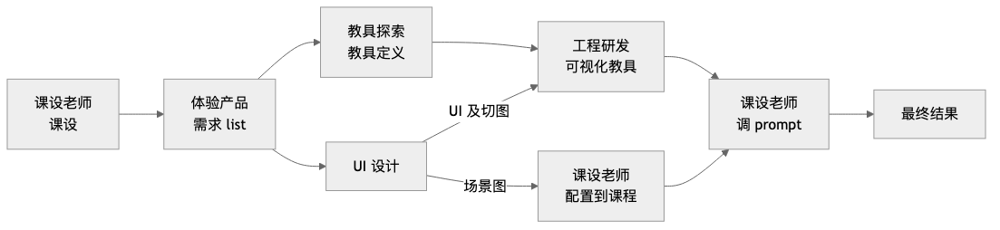
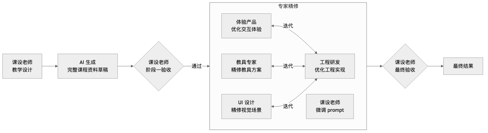

# AI 课程资料的自动化生产：Agent First 出可体验课程，专家向 AI 反馈保质量

## 问题

课程资料的生产链路太长了。

当前的生产方式是一条以串行为主、局部有分支的流水线：



体验产品出完需求 list 后，会分出两条支线：一条走教具探索→教具定义→工程研发实现可视化教具；另一条走 UI 设计，UI 的产出物分两部分——UI 及切图交给工程研发用于可视化教具的实现，场景图交给课设老师配置到课程上。两条支线最终汇合后，课设老师才能开始在完整环境中调整 prompt。

虽然有局部的并行，但整条链路的主干仍然是串行的——每个大环节都依赖上一个环节的完整交付才能启动。课设老师完成课程设计后，体验产品才能开始梳理需求；需求 list 确认后，教具探索和 UI 设计才能同步启动；教具开发和 UI 场景图都完成后，课设老师才能开始调整 prompt。

核心点在于：**这条链路的瓶颈不是任何单个环节的效率，而是环节之间的等待时间。** 每一次交接都意味着一次上下文切换、一轮沟通对齐、一段排期等待。多个环节串联下来，即使每个环节本身只需要两天，端到端的周期也远不止十天——因为中间的等待和返工才是真正的时间黑洞。

更麻烦的是返工。课设老师在最后阶段调整 prompt 时，经常会发现教具的交互逻辑不完全符合教学意图，或者 UI 场景图与教学节奏不匹配，这时候需要回到上游环节修改，又是一轮串行等待。

## 新的思路

一句话描述：**构建一个自动化生产 Agent，让它先生成包含所有内容的完整课程资料，所有人都在这个 Agent 上工作。**

具体来说，这个 Agent 内部由多个 skill 组成——教具生成 skill、板书生成 skill、UI 场景生成 skill、prompt 生成 skill 等——每个 skill 对应旧流程中一个专业角色的工作。Agent 在一个 Ralph Loop 中按需调用各个 skill，最终生成完整的课程资料草稿。

这个方案带来两个根本性的变化：

**第一，从 Day 1 开始就有一个可体验、可交互的完整课程。** 旧流程中，一节完整可用的课程要等到所有环节跑完才能看到。在此之前，每个环节只能产出中间产物——需求文档、教具定义文档、UI 切图——大家都在对着抽象描述想象最终效果。新流程中，Agent 直接产出一个可以跑起来的课程，所有人从第一天起就能看到、体验、交互，省掉了大量用于对齐认知的中间产物。

**第二，所有人的角色从执行者变为审核者。** 课设老师和各方向专家不再是流水线上的执行节点，而是 Agent 的使用者和调优者。核心逻辑从"人串行交付"变成了"AI 先出草稿，专家提反馈，AI 改"。

### 生产流程对比

**旧流程（串行）**：


**新流程（先完整生成，再并行精修，最终验收）**：



### 三个阶段

**阶段一：AI 生成 + 课设老师验收**

课设老师提出教学目标和设计意图，AI 生成一份包含完整内容的课程资料草稿——包括教学流程、板书内容、可视化教具、教具交互定义、prompt 等所有要素。也就是说，AI 的产出从一开始就是一个可运行的、包含可视化教具的完整课程，而非纯文本方案。

这个阶段的关键判断标准是：**课设老师认为教学设计的意图已经被充分表达。** 不追求每个细节都完美，而是确保教学逻辑、知识点覆盖、互动节奏这些核心设计要素是对的。

这一步本质上是把原来散落在多个环节中的"设计决策"集中到了一个人和 AI 的协作中完成。课设老师不再需要等待下游环节的实现才能验证自己的设计——AI 生成的草稿虽然粗糙，但足以让课设老师判断方向是否正确。

**阶段二：各方向专家并行精修**

课设老师验收通过后，各方向专家并行介入，审查草稿中自己专业领域的部分，给 Agent 提出反馈建议，由 AI 执行修改。专家负责的是确保最终交付质量达标，而不是自己动手改：

| 角色 | 职责 | 审查范围 | 交付标准 |
|------|------|---------|---------|
| 体验产品 | 审查交互体验，提出优化建议 | AI 草稿中的交互设计部分 | 交互流程顺畅、用户体验达标 |
| 教具专家 | 审查教具的数学模型和交互定义 | AI 草稿中的教具定义部分 | 数学正确、交互定义精确 |
| 工程研发 | 审查工程实现质量（性能、兼容性、边界case等） | 教具专家精修后的协议文档 | 工程质量达标 |
| UI 设计 | 审查视觉场景、界面风格与视觉细节 | AI 草稿中的视觉呈现部分 | 视觉规范一致、场景图精准 |
| 课设老师 | 审查 prompt 和教学细节 | 完整草稿 | prompt 准确表达教学意图 |

关于并行度，有几点值得展开：

- **局部存在先后依赖。** 并非完全并行——比如工程研发需要等教具专家精修后的协议文档和 UI 设计的切图，体验产品的交互优化也会影响工程研发的最终实现。这些角色和工程研发之间还可能经历几轮迭代，但由于都是基于已有的可运行课程做增量调整，预期会比较快收敛。
- **AI 能力决定实际并行度。** 这里的并行度和收敛速度高度依赖于 AI 独立完成工程实现的能力——如果 AI 生成的代码质量足够高，工程研发与其他角色之间的迭代轮次会大幅减少；极端情况下，工程研发的角色会从"实现者"退化为"值班处理 AI 生成代码中的问题"。
- **核心优势不变。** 无论局部串行如何，始终有一个可体验的完整课程版本，各专家基于同一份设计蓝图审查和调优，不需要等从零构建。

实际执行中更接近"大面积并行，局部串行迭代"。

**阶段三：课设老师最终验收**

各方向专家完成精修后，课设老师做最终验收。这一步的判断标准和阶段一不同——阶段一验收的是"设计意图是否被表达"，阶段三验收的是"各专业维度的优化是否破坏了原有的教学设计意图"。

之所以需要这一步，是因为各专家在自己领域内的优化，可能会无意中改变课程整体的教学节奏或互动逻辑。课设老师作为教学设计的最终负责人，需要从全局视角确认所有修改合在一起后，课程仍然是一个完整、连贯的教学体验。

## 为什么理论上更快

**减少了等待。** 旧流程中，多个环节以串行为主，总时间 ≈ 各环节耗时之和 + 环节间等待时间。新流程中，阶段二的多个角色并行工作，总时间 ≈ 阶段一耗时 + 阶段二中最慢角色的耗时。

**减少了返工。** 旧流程中，课设老师要到最后一步才能在真实环境中验证设计意图，发现问题就要回滚到上游修改。新流程中，课设老师在阶段一就已经通过 AI 草稿验证了设计意图，后续专家的精修是在一个方向已确认的基础上做的，大方向上的返工概率大幅降低。

**降低了沟通成本。** 旧流程中，每次环节交接都需要"翻译"——课设老师的教学语言翻译成产品需求，产品需求翻译成教具定义，教具定义翻译成工程实现。每一次翻译都有信息损耗。新流程中，AI 生成的完整草稿本身就是一份所有人共享的、具体的参照物，各专家直接基于它审查和反馈，省去了多轮抽象转译。

用一个粗略的模型来看：

```
旧流程耗时 ≈ T(课设) + T(体验) + max(T(教具)+T(工程), T(UI)) + T(调prompt) + N×T(等待)

新流程耗时 ≈ T(AI生成+课设验收) + max(T(体验), T(教具), T(工程), T(UI), T(调prompt)) + T(最终验收)
```

即使 AI 生成 + 课设验收本身需要一定时间，只要阶段二的并行能够成立，总周期就会显著缩短。

## 为什么对 AI 生成质量有信心

换一个角度看这个问题：一个知识主题的完整课程资料——教学流程、板书内容、教具定义、prompt、UI 场景——本质上可以类比为一个代码库。它有明确的目标（教学目标），有多个模块（各环节的内容），模块之间有依赖关系和接口约定。

关键在于，这个"代码库"按行计数的规模远小于一般的软件项目。一节课的完整资料可能只有几百到一两千行结构化内容，而 AI 在同等规模甚至更大规模的代码生成任务上已经展现了相当的能力。从这个角度看，可以预期 AI 生成课程资料草稿的成功率较高。

## 这个方案成立的前提

坦诚地说，这个流程能跑通有几个前提条件：

1. **AI 的生成质量要够用。** 不需要完美，但草稿需要覆盖所有必要的要素——教学流程、教具定义、prompt 等——且质量足以让课设老师做出"方向对不对"的判断。如果 AI 生成的东西太粗糙，课设老师没法验收，阶段一就会反复迭代，抵消掉并行带来的收益。

2. **局部串行依赖不能拖垮整体并行。** 如前所述，部分角色之间存在先后依赖。需要在实际执行中验证这些局部串行是否会成为新的瓶颈。

3. **"课设老师验收"这个关卡要够快。** 如果课设老师需要反复让 AI 重新生成才能达到满意，阶段一本身可能就变成了一个耗时的环节。这取决于 AI 的能力和课设老师与 AI 协作的熟练度。

## 更远一步

回到前面说的 Agent 模型——阶段二中各方向专家的精修，实际上在做两件事：

1. **调整当前课程的产出物。** 这是直接可见的工作——精修这一节课的教具方案、优化这一节课的视觉场景。
2. **调优 Agent 中对应 skill 本身。** 专家在精修过程中发现的规律性问题（比如"AI 生成的教具总是缺少边界case的处理"），可以反馈回对应 skill 的 prompt 或规则中，让下一次自动生成的质量更高。

这意味着每一轮"AI 生成 → 专家精修"不只是在生产一节课，还在持续改进生产系统本身。随着 skill 被不断调优，阶段二中专家需要精修的工作量会逐步减少，生产效率会随迭代轮次递增。

这不是遥远的未来——只要新流程跑起来，这个改进循环就会自然发生。当前的核心命题是：先把"串行流水线"变成"Agent 生产 + 专家并行调优"，验证这条路是否真的能提速。
