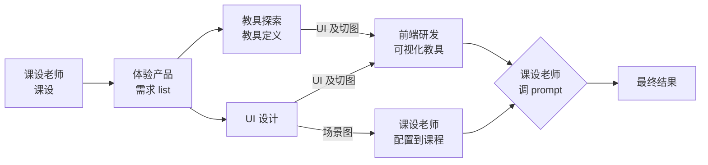
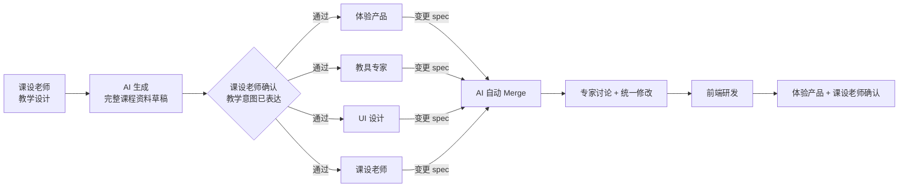
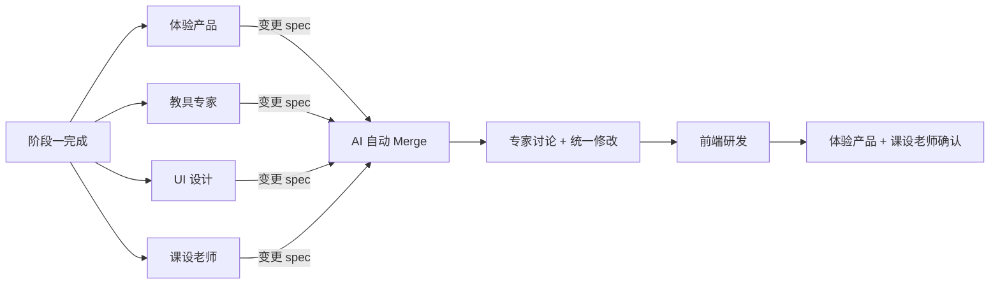

# AI 课程资料的自动化生产：知识主题即代码仓库，Agent First 出完整课程

## 问题

课程资料的生产链路太长了。

当前的生产方式是一条以串行为主、局部有分支的流水线：

 

 

体验产品出完需求 list 后，会分出两条支线：一条走教具探索→教具定义→前端研发实现可视化教具；另一条走 UI 设计，UI 的产出物分两部分——UI 及切图交给前端研发用于可视化教具的实现，场景图交给课设老师配置到课程上。两条支线最终汇合后，课设老师才能开始在完整环境中调整 prompt。

虽然有局部的并行，但整条链路的主干仍然是串行的——每个大环节都依赖上一个环节的完整交付才能启动。课设老师完成课程设计后，体验产品才能开始梳理需求；需求 list 确认后，教具探索和 UI 设计才能同步启动；教具开发和 UI 场景图都完成后，课设老师才能开始调整 prompt。

核心点在于：**这条链路的瓶颈不是任何单个环节的效率，而是环节之间的等待时间。** 每一次交接都意味着一次上下文切换、一轮沟通对齐、一段排期等待。多个环节串联下来，即使每个环节本身只需要两天，端到端的周期也远不止十天——因为中间的等待和返工才是真正的时间黑洞。

更麻烦的是返工。课设老师在最后阶段调整 prompt 时，经常会发现教具的交互逻辑不完全符合教学意图，或者 UI 场景图与教学节奏不匹配，这时候需要回到上游环节修改，又是一轮串行等待。

## 新的思路

一句话描述：**把一个知识主题的资料生产，看作是在一个空的代码仓库上开发一个项目。构建一个自动化生产 Agent，让它先生成包含所有内容的完整课程资料，所有人都在这个 Agent 上工作。**

一个知识主题的完整课程资料——教学流程、板书内容、教具定义（含数学模型和交互协议）、prompt、UI 场景描述——本质上就是一个代码库。

### 新旧流程对比

**旧流程（串行）**——人串行交付，完整课程要等所有环节跑完才能看到：

**新流程（先完整生成，再并行精修，集中定稿）**：

### 两个根本性变化

**从 Day 1 开始就有一个可体验、可交互的完整课程。** 旧流程中，一节完整可用的课程要等到所有环节跑完才能看到。在此之前，每个环节只能产出中间产物——需求文档、教具定义文档、UI 切图——大家都在对着抽象描述想象最终效果。新流程中，Agent 直接产出一个可以跑起来的课程，所有人从第一天起就能看到、体验、交互，省掉了大量用于对齐认知的中间产物。

**所有人的角色从执行者变为审核者。** 课设老师和各方向专家不再是流水线上的执行节点，而是 Agent 的使用者和调优者。核心逻辑从"人串行交付"变成了"AI 先出草稿，专家提反馈，AI 改"。

### 两个阶段

**阶段一：AI 生成 + 课设老师确认教学意图**

课设老师提出教学目标和设计意图，AI 生成一份包含完整内容的课程资料草稿——包括教学流程、板书内容、可视化教具、教具交互定义、prompt 等所有要素。也就是说，AI 的产出从一开始就是一个可运行的、包含可视化教具的完整课程，而非纯文本方案。

这个阶段的关键判断标准是：**课设老师认为教学设计的意图已经被充分表达。** 不追求每个细节都完美，而是确保教学逻辑、知识点覆盖、互动节奏这些核心设计要素是对的。

这一步本质上是把原来散落在多个环节中的"设计决策"集中到了一个人和 AI 的协作中完成。课设老师不再需要等待下游环节的实现才能验证自己的设计——AI 生成的草稿虽然粗糙，但足以让课设老师判断方向是否正确。

**阶段二：各方向专家并行精修**

课设老师认为草稿已经充分表达了自己的教学意图后，各方向专家并行介入，审查草稿中自己专业领域的部分，给 Agent 提出反馈建议，由 AI 执行修改。专家负责的是确保最终交付质量达标，而不是自己动手改。

**并行协作流程：** 各专家以 Git worktree 模式工作，每人在独立的 feature branch 上专注修改自己负责的部分。整体时序如下：

体验产品、教具专家、UI 设计、课设老师四个角色同时开工，各自在 feature branch 上完成精修。

**变更 spec 生成：** 每个专家完成精修后，AI 根据该 branch 上的修改内容和专家与 AI 的对话记录，自动生成一份结构化的变更 spec——描述改了什么、为什么改、影响哪些模块。这份 spec 让后续的合并和审查不再依赖裸 diff，而是基于每个专家变更的意图和范围来进行。

**AI 自动 Merge：** 基于各专家的变更 spec，AI 先在语义层面判断是否存在跨模块矛盾，再执行自动 merge。合并后生成风险报告，标记出需要专家关注的冲突点。merge 冲突由 AI 先尝试自动解决，解决不了的升级给相关专家协商。

**专家讨论 + 统一修改：** 专家针对 AI 标出的风险点做判断和微调，确保合并后的版本协调一致。讨论中产生的修改同样由 AI 生成变更 spec，追加到已有的 spec 中，保证前端研发拿到的是一份完整的、覆盖所有变更意图的输入。

**前端研发介入：** 专家讨论和统一修改完成后，前端研发介入。此时交互方案、教具协议、UI 切图、prompt 都已合并、审查、修复完毕，前端研发基于最终的合并版本和完整的变更 spec 完成工程实现，避免返工。

**收敛条件：** 讨论中发现的问题，由体验产品发起协调，相关专家在合并后的版本上直接修复。

**出口条件：** 体验产品和课设老师共同确认最终版本没有问题，阶段二结束。

关于并行度，有几点值得补充：

* **AI 能力决定实际效率。** 如果 AI 生成的代码质量足够高，前端研发的工作量会大幅减少；极端情况下，前端研发的角色会从"实现者"退化为"值班处理 AI 生成代码中的问题"。

* **核心优势不变。** 无论局部串行如何，始终有一个可体验的完整课程版本，各专家基于同一份设计蓝图审查和调优，不需要等从零构建。

## 为什么理论上更快

**减少了等待。** 旧流程中，多个环节以串行为主，总时间 ≈ 各环节耗时之和 + 环节间等待时间。新流程中，阶段二的多个角色并行工作，总时间 ≈ 阶段一耗时 + 阶段二中最慢角色的耗时。

**减少了返工。** 旧流程中，课设老师要到最后一步才能在真实环境中验证设计意图，发现问题就要回滚到上游修改。新流程中，课设老师在阶段一就已经通过 AI 草稿验证了设计意图，后续专家的精修是在一个方向已确认的基础上做的，大方向上的返工概率大幅降低。

**降低了沟通成本。** 旧流程中，每次环节交接都需要"翻译"——课设老师的教学语言翻译成产品需求，产品需求翻译成教具定义，教具定义翻译成工程实现。每一次翻译都有信息损耗。新流程中，AI 生成的完整草稿本身就是一份所有人共享的、具体的参照物，各专家直接基于它审查和反馈，省去了多轮抽象转译。

## 为什么对 AI 生成质量有信心

回到前面的核心抽象——知识主题 = 代码仓库项目。这个类比不只是修辞，它直接决定了对 AI 生成质量的信心判断：

**从规模看，课程资料远小于 1 万行，而当前 Agent 已能稳定处理万行级项目。** 教学流程文档、多个教具的数学模型定义和交互协议、分环节的 prompt、板书内容描述、UI 场景配置——全部展开后的体量，对 AI 来说完全在能力范围内。AI 在同等甚至更大规模的代码生成任务上已经展现了稳定的能力：理解模块间依赖、保持接口一致性、生成可运行的完整项目。

**从结构看，课程资料比一般代码库更规整。** 代码库可能有复杂的继承层次、异步并发、分布式状态等难题，而课程资料的模块关系相对清晰——教学流程是主干，教具、板书、prompt、UI 场景是挂在主干上的子模块，子模块之间的耦合度有限。这意味着 AI 更容易保持全局一致性。

**从验证看，课程资料可以直接体验，但缺少代码那样的客观反馈。** 代码项目有编译和测试提供即时的、自动化的对错判断，课程资料没有这种机制——教学流程是否通顺、教具交互是否合理、prompt 是否达到教学意图，最终都依赖课设老师的主观判断。这意味着 AI 生成课程资料后的验证环节，比代码项目更依赖人的介入，收敛速度也更依赖课设老师与 AI 协作的熟练度。**如何为课程资料构建更客观、更自动化的反馈机制，是后面建设的核心位置。**

## 更远一步

回到前面说的 Agent 模型——阶段二中各方向专家的精修，实际上在做两件事：

1. **调整当前课程的产出物。** 这是直接可见的工作——精修这一节课的教具方案、优化这一节课的视觉场景。
2. **调优 Agent 中对应 skill 本身。** 专家在精修过程中发现的规律性问题（比如"AI 生成的教具总是缺少边界case的处理"），可以反馈回对应 skill 的 prompt 或规则中，让下一次自动生成的质量更高。

这意味着每一轮"AI 生成 → 专家精修"不只是在生产一节课，还在持续改进生产系统本身。随着 skill 被不断调优，阶段二中专家需要精修的工作量会逐步减少，生产效率会随迭代轮次递增。

这不是遥远的未来——只要新流程跑起来，这个改进循环就会自然发生。
