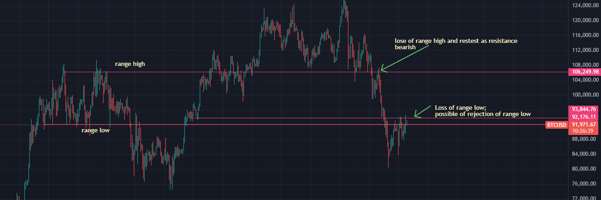
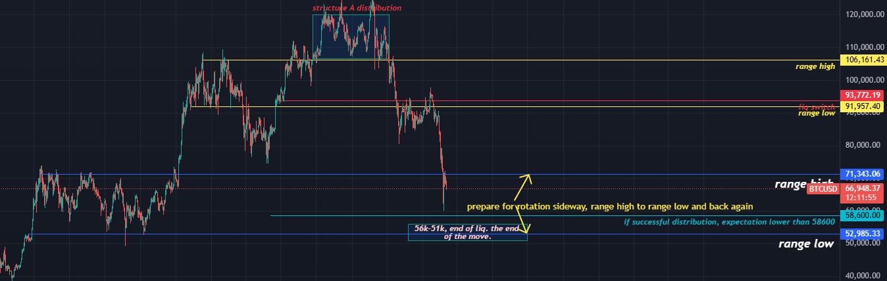
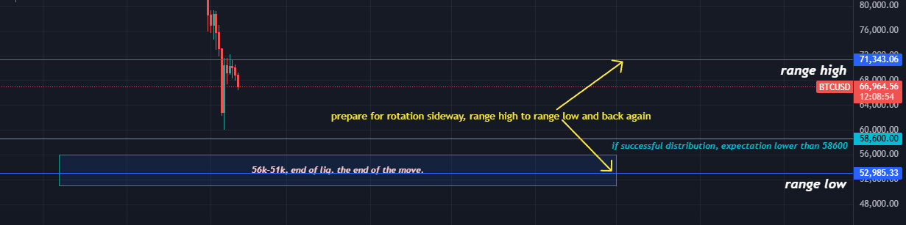

# Satoshi Cafe - #analysis-main-主要分析

频道链接：https://discord.com/channels/1447593124770746432/1448297791280381982

---

## 2025年12月10日

**M_Medi 21:45**
> now let us see what is happening in the markets now, it does look very similar structural wise but on a daily time frame

**M_Medi 21:45**
> coinbase btc

**M_Medi 22:23**
> any questions pls write it in the question channel

**M_Medi 22:23**
> or dm me

---

## 2025年12月26日

**M_Medi 18:21**
> although some bigger players have entered the market, we are still expecting the market to go down later, a new low is almost guaranteed. it is just a matter of how much short they wish to push out before the drop, that is why a hedge is recommended, especially for people with a 94k short

---

## 2026年2月11日

**M_Medi 19:48**

**M_Medi 19:49**
> we have almost reached our initial temporary bottom, now you would expect the selling pressure to weaken with time

**M_Medi 19:49**
> and prepare for a larger sideway market

**M_Medi 19:50**
> does it mean that 51 and 52k is the bottom, in my opinion it is not, but we will not go to our bottom instantly, bear market is going to need time

**M_Medi 19:51**

