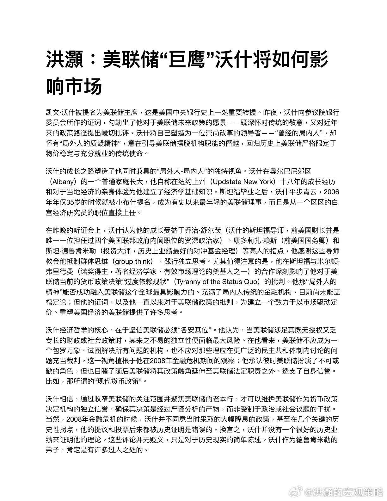
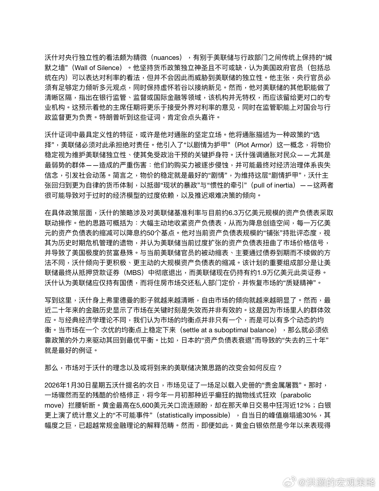
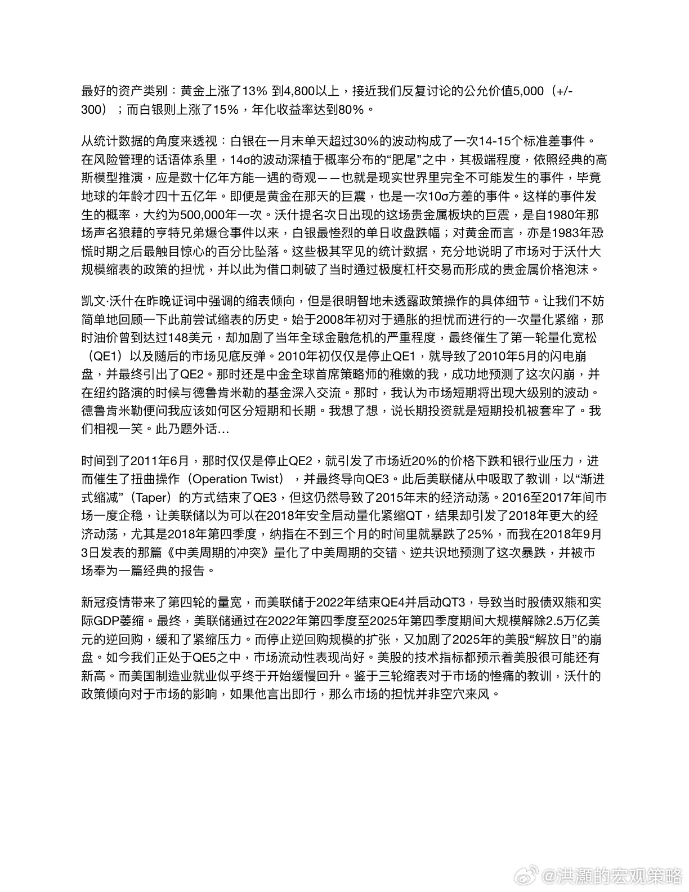
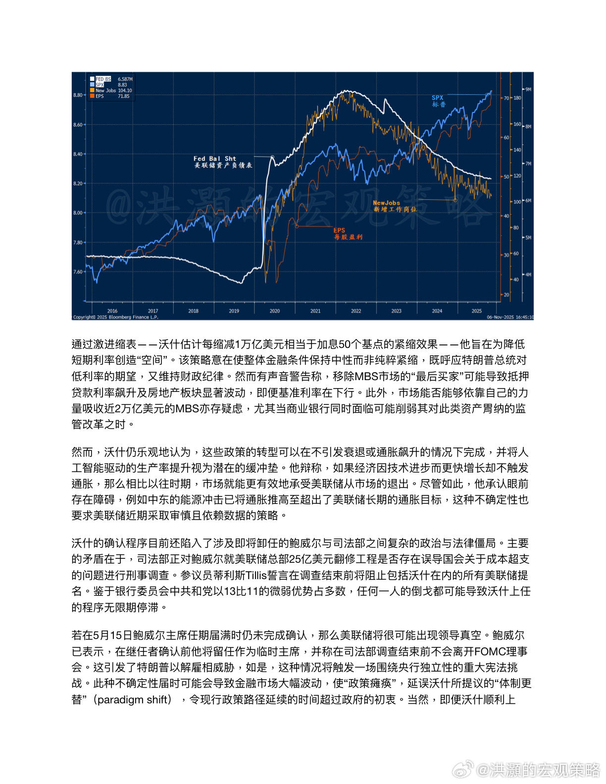
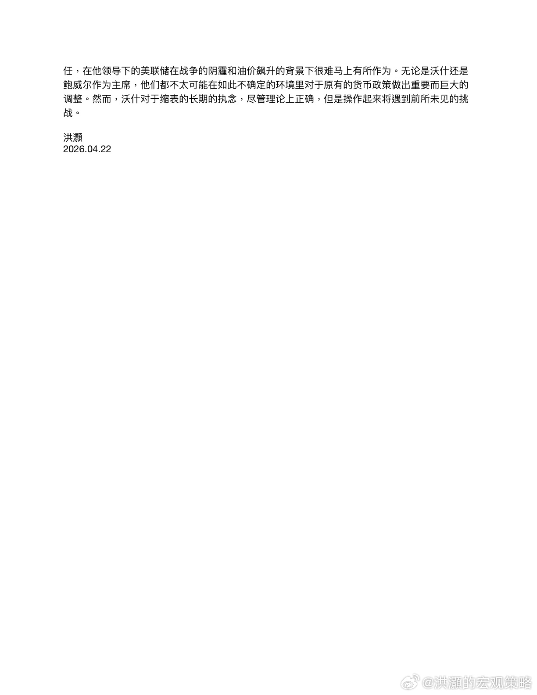

# 洪灝：美联储"巨鹰"沃什将如何影响市场

> 来源：微博 @洪灝的宏观策略
> 日期：2026-04-22 12:21
> 链接：https://weibo.com/7799274131/QBXKilbHo

凯文·沃什被提名为美联储主席，这是美国中央银行史上一处重要转捩。昨夜，沃什向参议院银行委员会所作的证词，勾勒出了他对于美联储未来政策的愿景——既深怀对传统的敬意，又对近年来的政策路径提出峻切批评。沃什将自己塑造为一位崇尚改革的领导者——"曾经的局内人"，却怀有"局外人的质疑精神"，意在引导美联储摆脱机构职能的僭越，回归历史上美联储严格限定于物价稳定与充分就业的传统使命。

沃什的成长之路塑造了他同时兼具的"局外人-局内人"的独特视角。沃什在奥尔巴尼郊区（Albany）的一个普通家庭长大，他自称在纽约上州（Updstate New York）十八年的成长经历和对于当地经济的亲身体验为他建立了经济学基础知识。斯坦福毕业之后，沃什平步青云，2006年年仅35岁的时候就被小布什提名，成为有史以来最年轻的美联储理事，而且是从一个区区的白宫经济研究员的职位直接上任。

在昨晚的听证会上，沃什认为他的成长受益于乔治·舒尔茨（沃什的斯坦福导师，前美国财长并是唯一一位担任过四个美国联邦政府内阁职位的资深政治家）、康多莉扎·赖斯（前美国国务卿）和斯坦·德鲁肯米勒（投资大师，历史上业绩最好的对冲基金经理）等高人的指点，他感谢这些导师教会他抵制群体思维（group think）、践行独立思考。尤其值得注意的是，他在斯坦福与米尔顿·弗里德曼（诺奖得主，著名经济学家、有效市场理论的奠基人之一）的合作深刻影响了他对于美联储当前的货币政策决策"过度依赖现状"（Tyranny of the Status Quo）的批判。他那"局外人的精神"能否成功融入美联储这个全球最具影响力的、充满了局内人传统的金融机构，目前尚未能盖棺定论；但他的证词，以及他一直以来对于美联储政策的批判，为建立一个致力于以市场驱动定价、重塑美国经济的美联储提供了许多思考。

沃什经济哲学的核心，在于坚信美联储必须"各安其位"。他认为，当美联储涉足其既无授权又乏专长的财政或社会政策时，其来之不易的独立性便面临最大风险。在他看来，美联储不应成为一个包罗万象、试图解决所有问题的机构，也不应对那些理应在更广泛的民主共和体制内讨论的问题充当裁判。这一视角植根于他在2008年金融危机期间的观察；他承认彼时美联储扮演了不可或缺的角色，但也目睹了随后美联储将其政策触角延伸至美联储法定职责之外、透支了自身信誉。比如，那所谓的"现代货币政策"。

沃什相信，通过收窄美联储的关注范围并聚焦美联储的老本行，才可以维护美联储作为货币政策决定机构的独立信誉，确保其决策是经过严谨分析的产物，而非受制于政治或社会议题的干扰。当然，2008年金融危机的时候，沃什并不同意当时采取的大幅降息的政策，甚至在几个关键的历史性拐点，他的提议和投票后来都被历史证明是错误的。换言之，沃什并没有一个很好的历史业绩来证明他的理论。这些评论并无贬义，只是对于历史现实的简单陈述。沃什作为德鲁肯米勒的弟子，肯定是有许多过人之处的。

沃什对央行独立性的看法颇为精微（nuances），有别于美联储与行政部门之间传统上保持的"缄默之墙"（Wall of Silence）。他坚持货币政策独立神圣且不可或缺，认为美国政府官员（包括总统在内）可以表达对利率的看法，但并不会因此而威胁到美联储的独立性。他主张，央行官员必须有足够定力倾听多元观点，同时保持虚怀若谷以接纳新见。然而，他对美联储的其他职能做了清晰区隔，指出在银行监管、监督或国际金融等领域，该机构并无特权，而应该留给更对口的专业机构。这预示着他的主席任期将更乐于接受外界对利率的意见，同时在监管职能上对国会与行政监督更为负责。特朗普听到这些证词，肯定会点头嘉许。

沃什证词中最具定义性的特征，或许是他对通胀的坚定立场。他将通胀描述为一种政策的"选择"，美联储必须对此承担绝对责任。他引入了"以剧情为护甲"（Plot Armor）这一概念，将物价稳定视为维护美联储独立性、使其免受政治干预的关键护身符。沃什强调通胀对民众——尤其是最弱势的群体——造成的严重伤害：他们的购买力被逐步侵蚀，并可能最终对经济治理体系丧失信念，引发社会动荡。简言之，物价的稳定就是最好的"剧情"，为维持这层"剧情护甲"，沃什主张回归到更为自律的货币体制，以抵御"现状的暴政"与"惯性的牵引"（pull of inertia）——这两者很可能导致对于过时的经济模型的过度依赖，以及推迟艰难决策的倾向。

在具体政策层面，沃什的策略涉及对美联储基准利率与目前约6.3万亿美元规模的资产负债表采取联动操作。他的思路可概括为：大幅主动地收紧资产负债表，从而为降息创造空间，每一万亿美元的资产负债表的缩减可以降息约50个基点。他对当前资产负债表规模的"铺张"持批评态度，视其为历史时期危机管理的遗物，并认为美联储当前过度扩张的资产负债表扭曲了市场价格信号，并导致了美国极度的贫富悬殊。与当前美联储官员的被动缩表、主要通过债券到期而不续做的方法不同，沃什倾向于更积极、更主动的大规模资产负债表的缩减。该计划的重要组成部分是让美联储最终从抵押贷款证券（MBS）中彻底退出，而美联储现在仍持有约1.9万亿美元此类证券。沃什认为美联储应仅持有国债，而将住房市场交还私人部门定价，并恢复市场的"质疑精神"。

写到这里，沃什身上弗里德曼的影子就越来越清晰，自由市场的倾向就越来越明显了。然而，最近二十年来的金融历史显示了市场在关键时刻是失效而并非有效的。这是因为市场里人的群体效应。与经典经济学理论不同，我们认为市场的均衡点并非只有一个，而是可以有多个动态的均衡。当市场在一个次优的均衡点上稳定下来（settle at a suboptimal balance），那么就必须依靠政策的外力来驱动其回到最优平衡。比如，日本的"资产负债表衰退"而导致的"失去的三十年"就是最好的例证。

那么，市场对于沃什的理念以及或将到来的美联储决策思路的改变会如何反应？

---

## 配图

