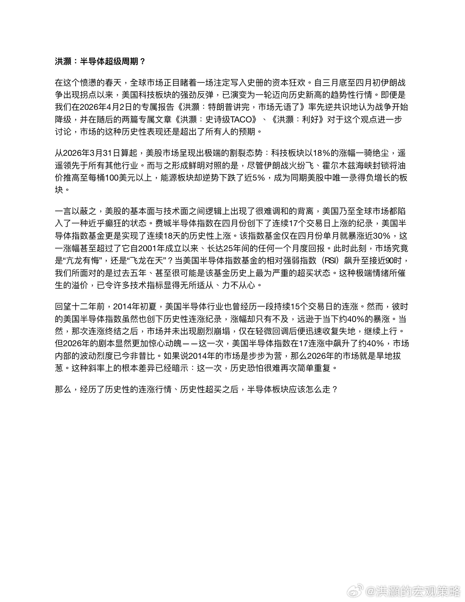
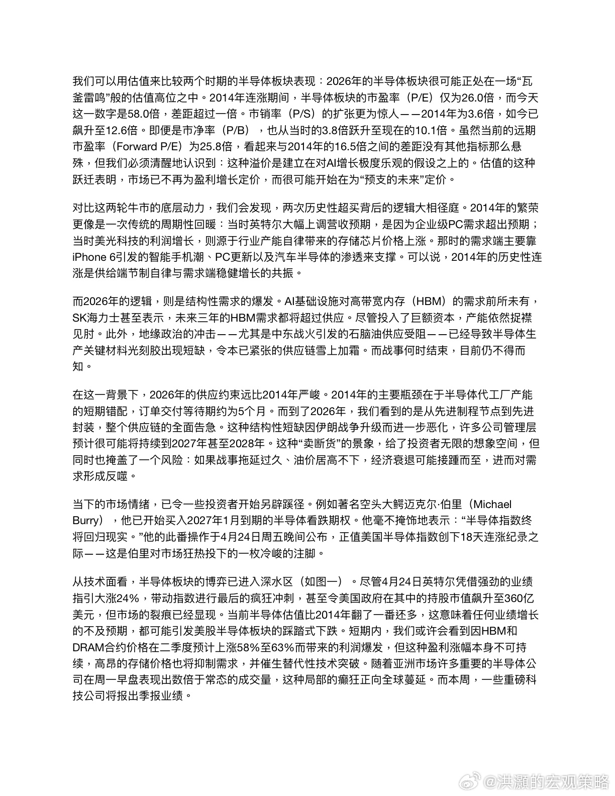
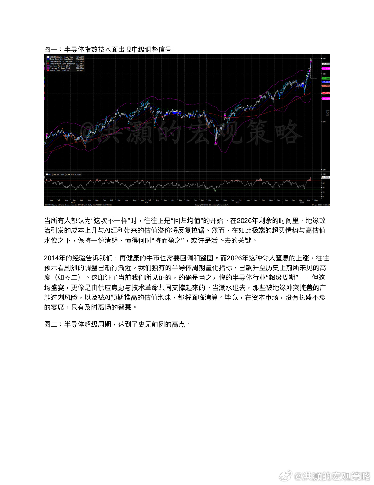
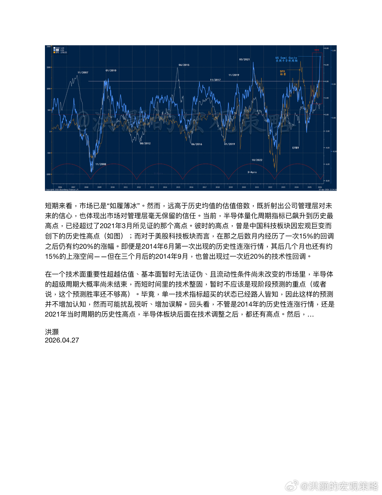

# 洪灝：半导体超级周期？

> 来源：微博 @洪灝的宏观策略
> 日期：2026-04-27 15:17
> 链接：https://weibo.com/7799274131/QCK2b2g6S
> 备注：以下为微博免费预览部分，完整版为微信公众号付费文章

在这个愤懑的春天，全球市场正目睹着一场注定写入史册的资本狂欢。自三月底至四月初伊朗战争出现拐点以来，美国科技板块的强劲反弹，已演变为一轮迈向历史新高的趋势性行情。即便是我们在2026年4月2日的专属报告《洪灝：特朗普讲完，市场无语了》率先逆共识地认为战争开始降级，并在随后的两篇专属文章《洪灝：史诗级TACO》、《洪灝：利好》对于这个观点进一步讨论，市场的这种历史性表现还是超出了所有人的预期。

从2026年3月31日算起，美股市场呈现出极端的割裂态势：科技板块以18%的涨幅一骑绝尘，遥遥领先于所有其他行业。而与之形成鲜明对照的是，尽管伊朗战火纷飞、霍尔木兹海峡封锁将油价推高至每桶100美元以上，能源板块却逆势下跌了近5%，成为同期美股中唯一录得负增长的板块。

一言以蔽之，美股的基本面与技术面之间逻辑上出现了很难调和的背离，美国乃至全球市场都陷入了一种近乎癫狂的状态。费城半导体指数在四月份创下了连续17个交易日上涨的纪录，美国半导体指数基金更是实现了连续18天的历史性上涨。该指数基金仅在四月份单月就暴涨近30%，这一涨幅甚至超过了它自2001年成立以来、长达25年间的任何一个月度回报。此时此刻，市场究竟是"亢龙有悔"，还是"飞龙在天"？当美国半导体指数基金的相对强弱指数（RSI）飙升至接近90时，我们所面对的是过去五年、甚至很可能是该基金历史上最为严重的超买状态。这种极端情绪所催生的溢价，已令许多技术指标显得无所适从、力不从心。

回望十二年前，2014年初夏，美国半导体行业也曾经历一段持续15个交易日的连涨。然而，彼时的美国半导体指数虽然也创下历史性连涨纪录，涨幅却只有不及，远逊于当下约40%的暴涨。当然，那次连涨终结之后，市场并未出现剧烈崩塌，仅在轻微回调后便迅速收复失地，继续上行。但2026年的剧本显然更加惊心动魄——这一次，美国半导体指数在17连涨中飙升了约40%，市场内部的波动烈度已今非昔比。如果说2014年的市场是步步为营，那么2026年的市场就是旱地拔葱。这种斜率上的根本差异已经暗示：这一次，历史恐怕很难再次简单重复。

那么，经历了历史性的连涨行情、历史性超买之后，半导体板块应该怎么走？

