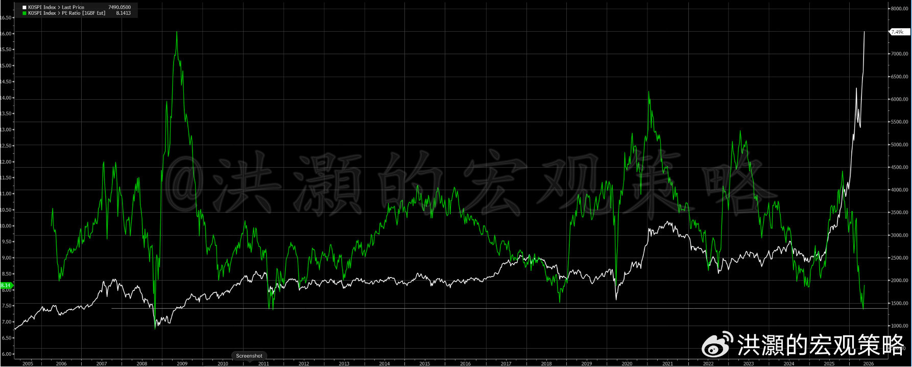
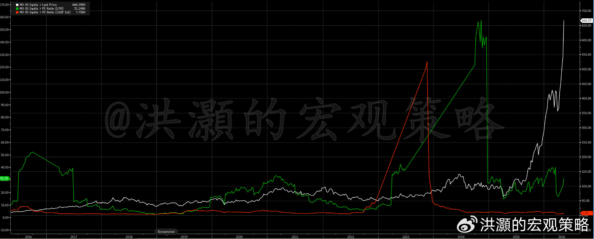
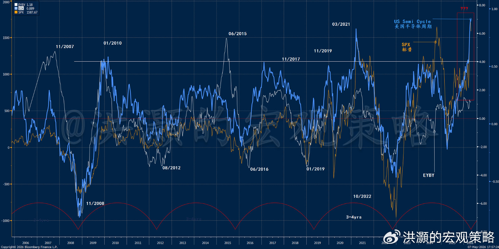

# 洪灝：站在光里看半导体超级周期

> 来源：微博长文 | 发布时间：2026-05-07 | 作者：洪灝
> 原文链接：https://weibo.com/ttarticle/p/show?id=2309405296012444172773

---

站在光里博弈。

当下的全球资本市场，一场由人工智能和半导体产业革命驱动的狂欢正在重塑我们对资产定价和统计学常识的认知。在这个由算力、算子与数据构筑的新纪元里，费城半导体指数（SOX）在短短25个交易日内飙升了54%，创下了自2000年3月互联网泡沫以来的最大、最长的同期连续涨幅。

然而，真正令全球宏观交易员和量化分析师感到敬畏的，是韩国综合股价指数（KOSPI）今年以来所展现出的、在统计学意义上近乎"海市蜃楼"般的极端历史性行情。截至5月6日，KOSPI在今年的回报率已经达到了令人瞠目结舌的70%+，遥遥领先于日经225指数同期的20%+、纳斯达克的11%以及标普500指数的8%。

如果我们将其置于过去20年KOSPI韩国指数的历史均值（11%）中去考量，这一年内迄今的表现已经高出均值2.25个标准差，这意味着它处于历史分布的最顶部1%的极端区间附近。更为罕见的是，在5月6日当天，KOSPI暴涨6.5%，历史上首次突破7000点大关并随后触及7500点。这单一交易日的涨幅比其20年来的日均回报率高出4.96个标准差。在一个正态分布的模型中，这种单天极速飙升发生的概率不到百万分之一。

在短短四个多月的时间里，KOSPI已经破记录地出现8个涨幅超过5%的交易日，不仅彻底打破了2008年全球金融危机期间该指数创下的全年6次的旧纪录，而且从泊松分布Poisson Distribution的罕见事件概率模型来看，在一个自然年内随机出现8次这种规模暴涨的概率大约只有250万分之一。这种彻底打破统计学常规的超级行情，直接推动韩国股票市场总市值激增71%至4.6万亿美元，一举超越加拿大成为全球第七大股票市场。

这种统计学上的极端偏离并非无源之水，其启动出发点和行情催化剂在于半导体行业史无前例的盈利业绩大爆发。在最近的财报季中，半导体板块迎来了2094个基点的、史上最大盈利预测上调，并在第一季度实现了1255个基点的收入增长，领跑了美股所有全行业。

这是一个极为宽广的、横跨各行各业的美股盈利上行周期，年初至今，全行业仅有16%的半导体上市公司遭遇了每股收益（EPS）的下调。在微观企业层面，超微一季度经调整后的每股收益达到1.37美元，轻松击败1.29美元的市场共识，营收更是大涨38%至102.5亿美元；美光的市值首次突破7000亿美元大关；而作为这轮KOSPI暴涨核心引擎的三星电子，受惠于内存价格的持续攀升，其半导体部门的营业利润预计将暴增1340%，直接推动其市值突破了1万亿美元的关口。

在去年11月份展望今年的市场和经济的时候，我们曾认为今年是一个蕴藏着巨幅波动、巨大泡沫的年份。如此的丙午火年如日中天，产生的巨变本身就是引人注目的泡沫。年初，我们曾目睹了令人眼晕目眩的黄金白银贵金属的史诗级行情。如今，半导体以及相关的标的出现的一系列超越统计常理、在正常的地球历史不应该发生的行情，在继续改写着人们的认知。一年内出现两次如此极端的泡沫化行情，还是会令即便是准备最充分的人都始料不及、手足无措的。

全球区域性市场的价格动能斜率也极度明显，新兴市场也迎来了20年来最大规模的盈利增长预期上调，其中高达94%的增量来自于信息技术板块，而韩国和中国台湾分别贡献了这其中的75%和15%。换言之，90%的盈利预期上调都是从这两个市场而来。而由于这两个市场都是半导体比重非常大的市场，因此新兴市场的盈利预期上调绝大部分都是从半导体行业而来的。存储芯片已经成为了当下整个AI供应链中最为关键的瓶颈，市场预计DRAM供不应求的情况将一直持续到2027年第四季度，从而为这一细分赛道创造了创纪录的盈利能力。

然而，问题来了。今年一个鲜为人知的事实是：尽管美股似乎在无视持续了十周的伊朗战争，并且自四月以来不断地创出历史新高，但是美股今年以来却大幅地跑输了新兴市场。如果当下的半导体人工智能的浪潮，美国依然占据着领先的地位，特朗普似乎依然在全球的地缘政治格局上颐指气使，那么为什么美国居然大幅跑输了科技上并不占优的新兴市场？

同时，如果未来两、三年的产能已经卖光，这种盈利的确定性和能见度为什么没有让半导体存储公司的市盈率比历史均值更高，而不是像现在如此低的各位数的水平？毕竟，现在的盈利增长和利润率都处于史无前例的水平。如果这次人工智能革命将带来史无前例的需求的持续增长，甚至如果机器最终替代了人类，那么为什么市场不愿意把盈利估值的倍数大幅地提高？毕竟，这世界上有80亿劳动力需要替代。

---

*以下内容为V+会员付费内容*

---

当前，市场共识认为，要理解这种盈利爆发的持续性，我们必须看看半导体行业正在出现的大趋势——即人工智能正在从基于提示词的对话式大语言模型（LLM）向"代理型人工智能"（Agentic AI）发生范式跃迁。代理型AI不再仅仅是被动回答问题，而是能够在后台持续运行，自主规划、执行、验证和纠错，这种运行模式的改变将带来代币（Token）消耗量的指数级飙升。然而，这个代币需求爆发的故事已经讲了大半年了。

根据彭博数据和市场预期测算，随着企业端和消费端代理型AI的普及，到2030年，全球每月的代币消耗量将猛增至120亿亿次（120 quadrillion），相当于2026年全球代币消耗总量的24倍；而到2040年知识工作者大规模采用的顶峰时期，这一消耗量将激增55倍。至关重要的是，这种使用量的爆炸不仅是一个需求端的叙事，更是一个关于利润率扩张的拐点故事。随着半导体龙头企业的技术迭代，算力的单位成本正在大幅跳水，例如谷歌/博通的TPU v7相比于v6在每代币成本上实现了约70%的降幅，其绝对成本已经足以与英伟达的GB200 NVL72相抗衡。当底层算力成本以每年60%至70%的速度下降，而前端大模型厂商的代币定价开始趋于稳定甚至在某些用例中上涨时，整个AI生态系统的单位经济考量将迎来历史性的利润率正向拐点。

在硬件层面，除了核心算力由于物理光刻极限的约束外，创新正在向网络连接、高带宽内存（HBM）以及先进封装（如CoWoS）等领域转移。在这一进程中，尽管定制化ASIC芯片（如TPU和Trainium）在原始计算成本上正在与原来的GPU缩小差距，但英伟达凭借其深度绑定的CUDA软件生态系统和极快的产品上市周期，其统治地位暂时还是无法颠覆的。

然而，面对如此强劲的增长基本面，半导体的估值体系却向投资者呈现出一个充满悖论的复杂图景。如果我们单纯审视市盈率（PE）的绝对数值，许多巨头似乎已经高不可攀：博通目前的市盈率为76倍，比其10年历史均值高出71%；应用材料市盈率高达44倍，溢价126%；泛林集团达到52倍；而AMD的市盈率更是高达123倍，英特尔则因盈利困境被推高至431倍的畸形水平。但如果投资者仅仅因为这些超越历史均值的绝对市盈率就望而却步，那无疑是胶柱鼓瑟。

当我们引入增长调整后的视角，半导体板块就显得相当克制。当前SOX指数的未来十二个月市盈率为26倍，但其背后支撑的是高达33%的长期EPS复合年增长率（CAGR）；相比之下，标普500指数的市盈率虽然看似只有22倍，但其长期盈利增长率预期仅为15%。甚至处于风暴中心的英伟达，当前43倍的市盈率实际上依然低于其59倍的10年历史均值，这充分反映了其盈利增速远远跑赢了股价的涨幅。

与此同时，板块内部的估值分化极其严重。半导体资本设备领域经历了猛烈的估值扩张，而处理器领域的估值却出现收缩；高通的市盈率仅为20倍，美光科技为30倍。更为显著的是地域维度的估值差异：尽管KOSPI今年表现极其狂热，但作为全球AI内存芯片绝对主导者的三星电子和SK海力士，其市盈率依然大幅低于台积电和美光科技等全球同行。这种半导体盈利势头与韩国股市相对不高估值的结合，使得资金无视了宏观经济层面的石油冲击风险，疯狂涌入首尔市场。

*图一：KOSPI指数和前瞻性市盈率*

然而，这些传统意义上的公司估值数据分析，都无法回答我们上述提出的问题：为什么美国作为科技革命的踏浪者却跑输了新兴市场？为什么市场不愿意给予那些半导体存储公司非常确定的利润量、非常丰厚的利润率更高的市盈率？

市场共识认为半导体公司的市盈率现在都非常低，因此这些公司的价值被严重低估。然而，如果我们以美光为例子，我们可以看到美光的明年的市盈率（前瞻性市盈率，用的是公司明年的美股盈利）过去十年其实一直都是个位数的（如图，红线）。因此，现在的8倍前瞻性市盈率并不意外，也并没有因为未来几年的产能全部卖光而出现估值的重估。换言之，半导体革命并没有带来估值的革命。

*图二：美光市盈率和前瞻性市盈率*

那么，为什么市场还是看到半导体公司爆表的盈利增长和前瞻性的指引就兴奋不已，资金对于这些股票趋之若鹜呢？显然，基本面变化无法解释这种抛物线式的上涨。当前市场的疯狂，只能从博弈的角度来解释了。

当前，宏观不确定性高企，而伊朗战争和居高不下的油价平增了这个不确定性。然而，美股的整体隐含波动率VIX还是很低。也就是说，整体的市场波动率与个股、板块之间的波动率不符，整体市场的隐含波动率被严重低估。在我们今年开年的报告里，我们就讨论过这个现象。这是由市场的内部结构变化决定的。末日期权交易的飙升和投行结构性产品的导致的negative gamma对冲效应使得整体市场的价格势能效应被放大。简单说，投行作为这些衍生品发行的对手盘必须持续的反向操作来中和它们交易本上的风险敞口。这种反向交易在市场暴跌暴跌的时候同向加速了市场的暴涨暴跌，并在特朗普不断TACO的预期下愈演愈烈。这不，美国市场一个月不到就完成了探底并创出了新高。这次战争中半导体板块的回调也只是接近20%。

*图三：半导体超级周期*

在这样的预期下，市场交易员必然在大级别的宏观不确定性中寻找弹性更好、确定性更强的标的——比如，当下的半导体存储。这些股票未来几年的盈利基本上已经锁定了，战争也无法影响盈利的兑现、而且战争本身也很快就要结束了。高油价的不确定性也即将消散，而全球经济两个主要的大国——美国已经成为了全球最大的产油国和石油出口国，并在这次伊朗战争中赚得盆满钵满；而中国早已引领了新能源革命，对于原油进口的能源依赖性已经下降到20%左右了。因此，对于投机资金，暂时很难再找到比半导体更好的投机标的了。

当下，上述的博弈逻辑很可能还将继续。我们在上一篇专属报告《洪灝：半导体超级周期？》中已经讨论过了：

> "短期来看，市场已是"如履薄冰"。然而，远高于历史均值的估值倍数，既折射出公司管理层对未来的信心，也体现出市场对管理层毫无保留的信任。当前，半导体量化周期指标已飙升到历史最高点，已经超过了2021年3月所见证的那个高点。彼时的高点，曾是中国科技板块因宏观巨变而创下的历史性高点（如图）；而对于美股科技板块而言，在那之后数月内经历了一次15%的回调之后仍有约20%的涨幅。即便是2014年6月第一次出现的历史性连涨行情，其后几个月也还有约15%的上涨空间——但在三个月后的2014年9月，也曾出现过一次近20%的技术性回调。"

> "在一个技术面重要性超越估值、基本面暂时无法证伪、且流动性条件尚未改变的市场里，半导体的超级周期大概率尚未结束，而短时间里的技术整固，暂时不应该是现阶段预测的重点（或者说，这个预测胜率还不够高）。毕竟，单一技术指标超买的状态已经路人皆知，因此这样的预测并不增加认知，然而可能扰乱视听、增加误解。回头看，不管是2014年的历史性连涨行情，还是2021年当时周期的历史性高点，半导体板块后面在技术调整之后，都还有高点。然后 …"

以史为鉴，极端狂热的行情总有其终局的剧本。交易的过度拥挤，大量资金在AI主线上形成了高度同质化的头寸，这种羊群效应一旦遇到边际预期的变化，极易引发流动性突然枯竭而导致的剧烈价格波动。半导体行业本质上依然是一个受制于全球GDP增速和宏观资本支出周期的强周期行业，而这次行业的定价模式，也将没有什么不同。

---

洪灝
2026.05.07
发布于 美国
