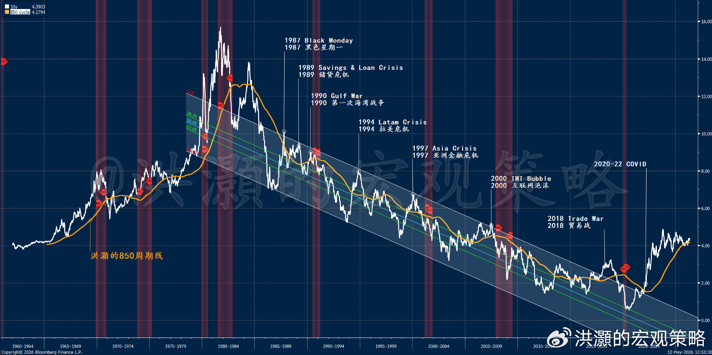
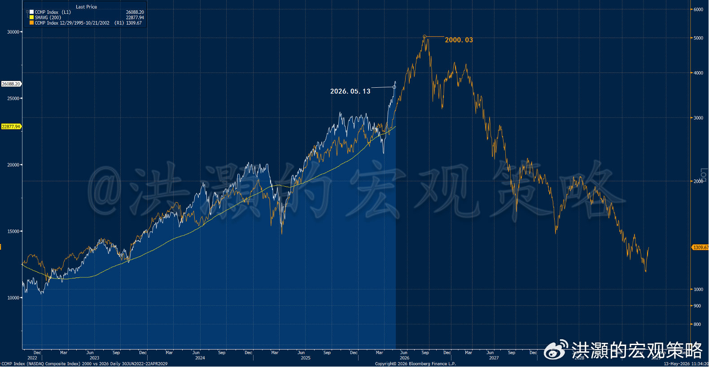

> **来源**: 微博长文
> **作者**: 洪灏（洪灝的宏观策略）
> **日期**: 2026-05-13
> **链接**: https://weibo.com/7799274131/QFayoFUW9
> **阅读数**: 53,942

# 洪灝：半导体超级周期距离顶部还有多久？

5月12日，标普500指数再创历史新高，然而也恰恰是在这个历史性的时刻，标普指数中有超过5%的成分股正触及其52周低点。类似的这种极端背离在美股近百年历史中仅出现过四次。前三次分别是：1929年7月、1973年1月、1999年12月。毋庸赘述，每一次指数内部结构走势如此这样极端的背离之后，都是一场摧枯拉朽的熊市。昨夜，美国劳工统计局公布的4月CPI数据显示，美国整体通胀率攀升至3.8%，创2023年5月以来新高，其中有接近一半的价格上涨都与原油有关。而核心通胀的环比变化似乎有加速的迹象。

半导体板块，这个以一己之力将美股指数推向新高、功不可没的板块在美债30年收益率再次突破5%的时刻遭遇了今年以来最猛烈的单日抛售：iShares半导体ETF（SOXX）重挫近7%。高通暴跌逾14%，创2020年以来最大单日跌幅；英特尔下跌11%。前一日刚触及其历史高点469美元的AMD急转直下，回落至400美元附近。唯独英伟达逆势收涨0.6%。

这一单日表现的分化本身也意味深长。这是在美国半导体指数在过去28日内的暴涨闯出了1982年程序化交易开启以来最大最快的涨幅之后。此刻的美股半导体板块占指数权重近16%，也是一项历史性的新高，也是标普指数中权重最大的板块。几周前发行的半导体板块ETF DRAM，仅用了36天就吸金65亿美元，是历史上新发行的所有美股ETF达到如此规模的最快的速度。

自3月30日低点以来，半导体贡献了标普全部涨幅的约40%。SOXX年初至今上涨近80%，英特尔过去一年涨幅超过430%。这已不是正常的股市回报——这是历史上往往在市场剧烈的均值回归之前才会出现的抛物线式的价格飙升。随着英特尔的股价飙升，对冲基金做空英特尔的仓位也飙升到了历史最高。当然，做空仓位的高企也是一把双刃剑。它既显示了市场里最聪明的钱对于当前股价的否定，但在市场暴涨时空头回补导致股票出现轧空行情的火药桶。

英伟达的独立走势值得关注。2018年半导体抛售中，英特尔因数据中心周期仍然完好而逆势上行。然而，如今的英特尔早已难为当年之勇，沦为了半导体中最弱的板块。虽然CPU需求将在Agentic AI 代理型AI中由于协调的需求而上升，但是迄今英特尔依然还是在讲故事的阶段。而当一个板块中最弱的股票开始大幅波动——涨得最猛、跌得也最惨时——这也正是教科书式的晚周期投机特征。1999年的注册了一个好网址的Pets.com的走势如此，今天涨了430%的英特尔很可能亦然。

4月CPI数据证实了原油价格过去数月以来发出的信号：伊朗战争正在制造一场真实的通胀冲击，且已开始向能源以外的领域扩散。整体CPI已经从1月的2.4%飙升至4月的3.8%——三个月内跃升140个基点，这是自新冠疫情后通胀飙升以来最快的通胀加速。

能源成本同比上涨17.9%，为2022年9月以来最大涨幅，主要是因为汽油上涨了28.4%，而燃油上涨54.3%。但更令人不安的是，核心CPI环比上涨0.4%，高于市场预期的0.3%，也高于2月和3月的0.2%。核心通胀月率0.4%，年化后达到4.8%——远超美联储2%的目标逾一倍。住房通胀从3%重新加速至3.3%，食品价格也在走高。能源冲击正在渗透到经济生活中的方方面面。密歇根大学消费者信心指数进一步印证了这种冲击。该指数调查中，约三分之一的消费者主动提及汽油价格对于通胀预期的影响，另有30%则提到了关税。当下，五年期通胀预期为3.4%，也远高于美联储可接受的水平。

虽然我们曾是市场上最早预测伊朗战争拐点的分析师，我们也继续认为伊朗战争已经降级，但目前战争最后的和平结束依然悬而未决。霍尔木兹海峡的交通依然尚未恢复正常，石油依然无法运出海湾。虽然原油现货市场Dated Brent相对于原油金融市场Brent Futures的溢价已经大幅收敛，但是逻辑上依然无法确认市场当前的定价已反映了原油价格的未来走势。

历史上，黄金的飙升往往领先原油约18个月。我们在之前的研究报告中也反复讨论了大宗商品周期中黄金白银贵金属——有色金属——能源——农产品的价格上涨先后顺序。黄金价格在今年二月份飙升到了阶段性的历史高点，而原油价格却似乎对于海湾局势的剑拔弩张视若无睹。当下100美元左右的原油价格，还不到70年代原油价格经过通胀调整后的200多美元的一半。如此，原油价格相对于局势的计价显然是掉以轻心的。这正是从"暂时性能源冲击"向"内生性二轮效应"演变的路径——与1973年石油危机从当时一次可控的扰动演变为长期的滞胀，如出一辙。于此同时，我们经典的美债十年收益率的历史走势，依然在850周期线上方徘徊，似乎预示着一次呼之欲出的模式转换（图一）。

**图一：美债十年收益率运行到了850周期线的上方。**

虽然当前的宏观流动性并没有出现明显的改善，但是表面之下的微观流动性架构，堪称积薪厝火。美国金融业监管局（FINRA）数据显示，保证金债务（margin loan融资）在2026年初达到创纪录的1.28万亿美元，同比增长36%。占GDP比重升至4.1%，几乎是过去50年历史中位数1.5%的三倍。净信贷余额——投资者持有的现金减去所欠款项——跌至创纪录的负8780亿美元。投资者对其持仓的杠杆程度，已达到有史以来的最高水平。

机构端同样令人侧目。高盛大宗经纪业务账面总杠杆率连续第三年攀升至历史新高。截至3月底，总杠杆率达到近300%。对冲基金在半导体板块的净敞口处于五年高位。对冲基金总借贷规模在三年内翻倍至6.8万亿美元。而关键在于，这些杠杆都集中于驱动指数上行的同一狭窄股票群体。

如此高的杠杆水平，在微观上的确边际改善了市场的交易流动性，但是也平增了市场对于短期波动的敏感度，导致市场暴涨暴跌。而将来在泡沫破灭的时候，这些极高水平的杠杆将导致补头寸call margin而导致的螺旋式下跌。当然，现在在市场上涨的时候，这些顺趋势的杠杆表面上增加了市场的微观交易流动性，然而上述的讨论也预示着，这些不修边幅的杠杆未来将成为市场泡沫破灭的导火索和加速器。杠杆流动性，既能载舟，也能覆舟。

叠加于此的，是我们也曾在专属文章里反复讨论的期权市场的结构性变革（请翻阅《洪灝：2025启示录》）。零日到期（0DTE）期权目前占标普500全部期权成交量的约50-60%。当做市商处于Negative Gamma负伽马状态——在当前环境中极为常见——他们必须在市场上涨时买入对冲、下跌时卖出而维持组合中立的态势，从而机械性地放大市场价格的双向波动。平日里，这种机制压低了已实现波动率，使VIX维持在偏低水平。而在像周二这样真实抛压出现的日子，同样的结构反向运作，加速下跌。顺便说一下，过去27个交易日VIX从31.5暴跌到16以下同时标普飙升约10%，这种情况历史上只出现过一次。其后，市场往往继续上涨。上一次出现这种情况，是2019年初。

综上所述：散户保证金、机构杠杆与期权市场力学三者同向共振、相互依存。它们携手创造了当下不断改善的微观交易流动性。然而，当其中任一环节断裂——无论是保证金追缴潮、经纪商收紧授信额度，还是伽马翻转——都会同步放大对于市场的冲击，导致泡沫破裂甚至破灭。美股指数之所以不断创新高，并非无视这些杠杆的存在，恰恰是因为这些杠杆的存在。而这也正是为什么，一旦市场价格势能反转到来，其过程将是非线性的。抛物线式的上涨，必然导致抛物线式的下跌。

当下，许多市场评论者们纷纷祭出2000年互联网泡沫作为参照，这种类比确有道理。当前的市场集中度实际上已超过2000年的峰值：前五大股票占标普500权重的27%，而互联网泡沫顶峰时仅为18%。估值虽然偏高，但不如当年极端——2000年科技板块以50倍远期市盈率交易，比今天可比科技估值高出约69%。

我们进一步更新了我们在4月25日发表的题为《洪灝：半导体超级周期》的报告里的当前市场和2000年互联网泡沫价格走势的分型结构图（图二）。可以看到，以纳指为代表的美股继续向其顶峰迈进。以史为鉴，如果当下的市场果真如2000年一样逐步泡沫化，那么市场登顶的窗口大约还有3到4个月的时间。请注意，这种分型价格走势分析有很多条件和局限性。历史不会简单重复，但往往押韵。这种分析也可以帮助冷却当下如日中天的市场情绪。

**图二：纳指2000年 vs 2026**

然而，更具启示意义的类比或许是1973年——而当前的通胀数据正在迅速拉近这一比较的距离。1973年1月，"漂亮50"股票——可口可乐、施乐、IBM、宝丽来——正将市场推向新高，而广度指标已在水面之下悄然恶化。当年秋天的阿拉伯石油禁运引发了能源冲击，在十八个月内将通胀率从约3%推高至12%以上。标普500在21个月内下跌了48%。

"漂亮50"旗下都是盈利真实的优质企业，但它们仍然下跌了50-70%——并非因为企业经营失败，而是因为宏观环境摧毁了市场愿意为哪怕最优秀的盈利所支付的估值倍数。当前的格局与之暗合：真实的AI需求、扎实的半导体盈利增长，却面对着油价冲击、通胀攀升、消费者信心跌至历史低谷，以及一位新任美联储主席正在经历他的第一场危机。

美联储新主席凯文·沃什是否会被迫在此环境下加息，是前景展望的核心变量。格林斯潘在1999年6月至2000年5月间六次加息，将联邦基金利率从4.75%提升至6.50%。纳斯达克在第五次加息后见顶。市场在前四次加息期间上涨了80%，当时市场多头辩称新经济对利率免疫。然而，格林斯潘2000年时是在温和通胀环境下主动选择加息。沃什则可能被迫在石油冲击驱动的通胀飙升中被动加息。虽然并非我们的基准预测情景，但此时消费者信心已处于历史低位。这不是未雨绸缪式的收紧，而是釜底抽薪式的紧急操作。而当前市场杠杆的水平，早已远超格林斯潘时代。

多头的论据并非毫无道理。量化紧缩（QT）已于2025年12月结束，移除了一个重要逆风。中国人民银行正在明确宽松，为全球流动性提供支撑。AI资本开支持续加速——美国超大规模云计算企业2026年计划在数据中心投入超过7000亿美元，其中四分之三在一季度财报后上调了预算。台积电预计全年营收增长将超过30%，并将2030年半导体市场规模预测上调至1.5万亿美元。英伟达本月晚些时候的财报若指引强劲，有可能重新加速价格动能交易。

但市场的微观流动性结构——创纪录的保证金债务、创纪录的机构杠杆、结构性主导地位的0DTE期权流，虽然改观了市场的短期交易流动性，但也意味着任何调整都将被放大到远超基本面本身所暗示的程度。

在此宏观背景下，VIX仍处于十几的水平，坦率地说，是由于市场交易结构改变而产生的错误定价。尾部风险保护相对于可能的结果分布而言仍然便宜。最脆弱的标的不是龙头，而是那些过度膨胀的二线半导体股票。虽然市场还在登顶的过程中，如果历史重演的话，我们还有三个月左右的时间窗口，但是此刻也不应该是加杠杆进行交易的时刻。至少，这样做对于睡眠质量毫无帮助。

如果你是巴菲特，此刻账上的几千亿美元的现金，应该会让你寤寐思服、辗转反侧。或许你的睡眠会比那些继续加杠杆交易的末日狂奔之徒更难熬。而市场可以继续保持非理性，直到你破产之后。1999年和1973年皆是如此。但在这两个案例中，最终的清算都是剧烈的，而从信号出现到转折到来，以月计而非以年计。弦已渐渐满张，催化剂已在运动之中。问题不再是风险是否真实——而是市场还能对它漠视多久。

最后，让我们重复我们四月底以来反复讨的投资逻辑：

"短期来看，市场已是"如履薄冰"。然而，远高于历史均值的估值倍数，既折射出公司管理层对未来的信心，也体现出市场对管理层毫无保留的信任。当前，半导体量化周期指标已飙升到历史最高点，已经超过了2021年3月所见证的那个高点。彼时的高点，曾是中国科技板块因宏观巨变而创下的历史性高点（如图）；而对于美股科技板块而言，在那之后数月内经历了一次15%的回调之后仍有约20%的涨幅。即便是2014年6月第一次出现的历史性连涨行情，其后几个月也还有约15%的上涨空间——但在三个月后的2014年9月，也曾出现过一次近20%的技术性回调。

在一个技术面重要性超越估值、基本面暂时无法证伪、且流动性条件尚未改变的市场里，半导体的超级周期大概率尚未结束，而短时间里的技术整固，暂时不应该是现阶段预测的重点（或者说，这个预测胜率还不够高）。毕竟，单一技术指标超买的状态已经路人皆知，因此这样的预测并不增加认知，然而可能扰乱视听、增加误解。回头看，不管是2014年的历史性连涨行情，还是2021年当时周期的历史性高点，半导体板块后面在技术调整之后，都还有高点。然后 …"

洪灝
2026.05.13
发布于 美国
