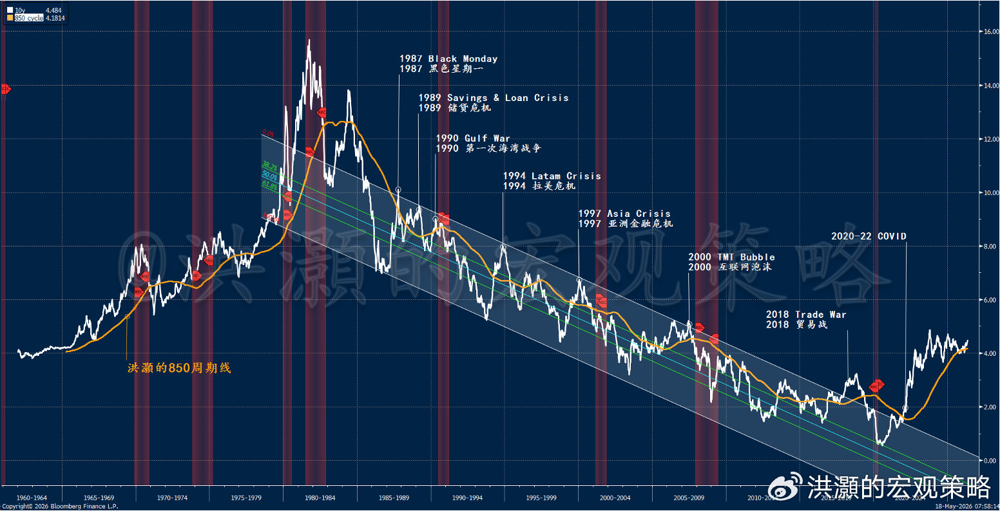
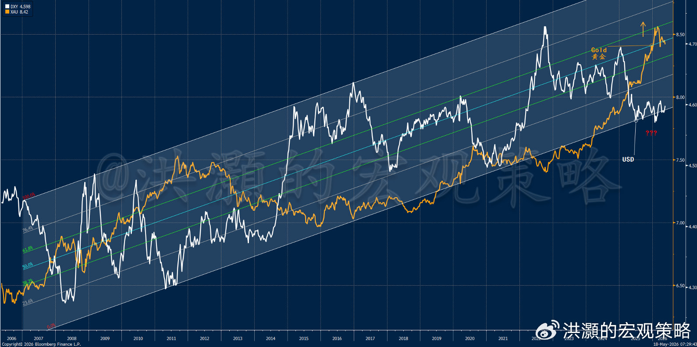
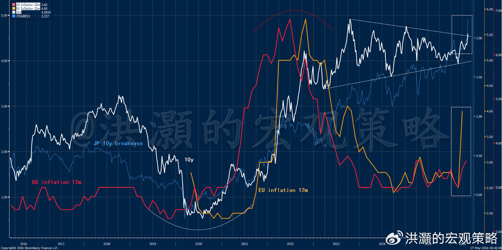
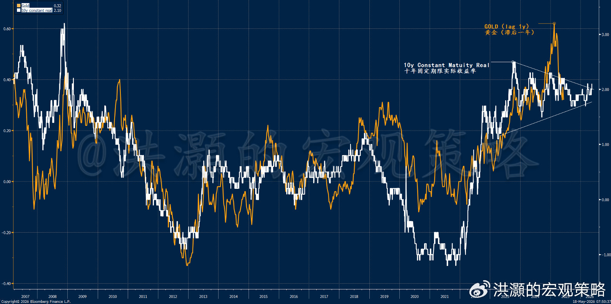
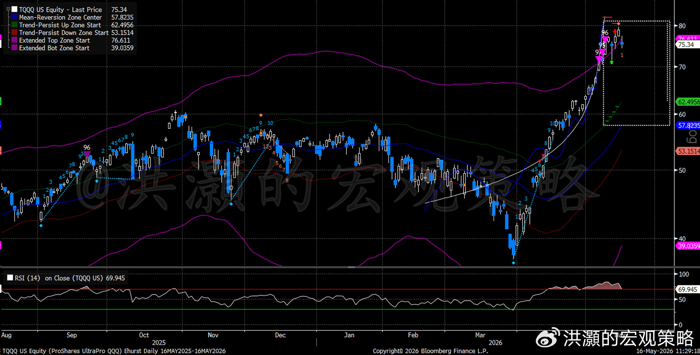

> 来源：微博文章（洪灝的宏观策略）
> 日期：2026-05-18
> 链接：https://weibo.com/ttarticle/p/show?id=2309405299840019464368

# 洪灝：全球债市在预示着什么

风满楼。

上周五，全球债券收益率猝然飙升。过去二十余年间，全球市场一直沉浸在一个安逸且高度绝缘的错觉之中：主权债务是一种不受约束的财政资源，已经脱离结构性通胀的引力，市场的力量已经无法合理定价发达国家政府债务。各国央行通过无休止的量化宽松操作，以最后买家的身份，成功掩盖了巨大的赤字支出，人为压低了债券的长期期限溢价，并为高杠杆的投机性资产提供了稳定的低成本资金。因此，即便疫情以来以美联储为首的全球央行天量放水，但市场依然义无反顾地上涨，并且还屡创新高。唯一不同的是，最近这两年鼓吹"现代货币政策"的声音似乎单薄了许多。

如今，之前的这套看似绝缘机制似乎开始失效了。上周五，一场全球同频、数倍标准差的收益率飙升，横扫了从东京到纽约的各家机构交易平台，暴露了资产配置体系中的技术性弱点，并迫使全球资本成本经历了一场实时的重新定价。统计上，这并非一次常规的日内调整，也不是对于某个单一的宏观经济数据发布的短暂反应。当然，上周美国的通胀预期大幅超预期，尤其是环比变化已经年化在5%左右，远远地超过了美联储的2%的长期通胀目标，而且通胀的上升速度令人侧目。

这场同步发生的全球债券抛售在周五下午冲击了全球股市，上半年如火如荼的价格动量驱动的行情开始显得岌岌可危了。周五，标普下跌1.2%，纳斯达克指数下跌1.5%，道指下跌537点。除能源板块之外，所有板块均深度收跌。随着美元指数飙升到99以上，新兴市场投降了，MSCI新兴市场指数下跌2.8%，韩国KOSPI指一度熔断。我们在太阳系第三颗行星上为读者预警了周五全球市场所遭遇的冲击。

这次全球债券收益率的同时飙升代表了一次显著的市场结构性裂痕开始出现——固定收益市场的根基性锚点同时飙升，使得久期资产和估值过高的成长股开始暴露于宏观模式切换之中。在我们的上一篇专属报告里，我们预警了十年美债收益率在850周期线上方盘踞整理，并且跃跃欲上，大有宏观模式转换的前兆（如图）。那些将其投资组合架构建立在对全球央行继续维持宽松的货币政策的投机者此刻开始发现：在伊朗战争导致的供给侧能源危机、结构性国防开支扩张以及跨境流动性传导机制有所失灵所形成的叠加之下，美联储乃至全球央行都开始陷入进退维谷之境。如何在增长和通胀之间维持货币政策的平衡，尤其是在通胀预期开始飙升的情景下，是一个悬而未决的难题。

此刻，交易员应该格外关注JGB日本国债市场的变化。5月15日周五，日本收益率曲线长端经历了一次具有历史性意义的剧变。当日，三十年期日本国债收益率单日飙升近20个基点，收于4%以上。这一历史性突破，标志着该合约自1999年问世以来首次击穿4.00%的心理关口，并很可能开始动摇全球宏观投资者的基准定价体系。

若把上周五日债的单天收益率飙升置于一个涵盖了逾1300个日度观测值的五年期完整统计数据中加以衡量，我们可以观察到这次飙升的历史性意义：这次单日日债长端收益率波动幅度相当于5.41个标准差。按照标准高斯模型，如此量级的日度波动在统计学上几乎不可能发生，其出现频率应低于数千个交易日一次，这使其一跃成为日本现代史上第八大单日收益率飙升事件。

以滚动五日计，上周32个基点的涨幅相当于4.30个标准差。这是一个极端的尾部风险事件，其猛烈的程度仅次于2025年4月关税冲击，以及2026年1月日本央行企图尝试政策正常化而导致的收益率飙升期间出现过的剧烈结构性调整。至关重要的是，日本收益率曲线短端仍被日本央行基准利率约束的制约，两年期日本国债收益率整周仅上涨区区3.1个基点。此种严重背离导致2s10s利差出现了20多个基点的Bear Steepening熊市陡峭化。换言之，日债长端收益率的飙升几乎是完全由期限溢价的剧烈重定价所驱动，而非对短期日本央行政策利率预期的调整。

日本长期债券第一次飙升超过了4%的心理价位而产生的全球影响是深远的。这样的长端收益率飙升可以通过甚嚣尘上的日元套利交易渠道对于全球市场产生影响，并使西方政府债务市场陷入动荡治乱，并冲击风险资产价格。

---

**以下内容仅V+会员可见**

数十年来，日本机构巨头——包括庞大的寿险公司、企业养老金计划以及大型商业银行——一直是国际主权债务、尤其是美债的主要边际买家。随着日元贬值趋势不停，这些日本机构将巨量的国内资本输出以锚定欧美各地的固定收益曲线。如今，有迹象表明这一结构性资本流动已然开始逆转。日本国内生产者价格指数在4月同比上涨了4.9%，创下十二年来最快的上游通胀增速——加之日本央行的管理委员会成员要求立即加息，摆出一幅极度鹰派的姿态，日本国内收益率环境已开始具有竞争力了。不像几年前，日本国债收益率接近0叠加日元的贬值趋势，使得以日元为融资货币的日元套利交易盛极一时。

如今，当考虑外汇对冲成本并与4%的日本国内长期债券收益率相比较时，美欧债券的历史性利差已经开始失去了其对于国际投机者的吸引力。日本资产管理者开始加持大规模的离岸固定收益资产。这种变化的结果很可能是，资本流向开始发生变化，海外资金开始回流日本。在短短数周内，日本机构减持了约近5万亿日元（相当于约300亿美元）的美国国债。在西方政府债净供给开始指数级扩张之际，日本机构突然从西方债务结构中抽走这一重要的流动性基础，必然导致复合效应：日债收益率攀升推高了从美国和德国的政府借贷成本，尤其是长端。

这场全球债券市场的传染，正与美联储领导层交接的时间点重合，给已然脆弱的宏观环境带来了很大的政策不确定性。鲍威尔作为美联储主席的四年任期于5月15日正式届满，理事会只得任命其为临时主席，作为一种不稳定的过渡机制，直至其继任者正式宣誓就职。凯文·沃什，在5月14日以54比45的微弱优势通过参议院确认投票。这应该是现代史上美联储主席确认过程中党派色彩最浓、政治分歧最大的一次。

赌市在2026年头几个月曾认为沃什会比现任委员会采取更为鸽派的立场，但此刻正逐渐清醒地认识到一个新的现实：这位即将上任的主席面对的宏观数据对他的货币政策挑战形成约束。沃什已明确承诺保持央行的独立性，且未向特朗普作出任何关于近期降息的承诺，尽管面临巨大的降息政治压力。更重要的是，沃什接手之际，债券市场已经在主动收紧金融条件——美国十年期国债收益率周五上涨11个基点至4.6%，三十年期国债收益率上涨9个基点至5.12%，创下2007年全球金融危机爆发以来的最高收盘水平。

沃什带到主席职位上的核心政策框架，代表着对过去十年货币哲学的根本性背离，其重点强调大幅收缩央行在经济中的存在。沃什认为美联储的资产负债表臃肿不堪，并明确表示其意图是缩小美联储的资产负债表，也就是量化紧缩，以缩小美联储对资产价格的扭曲性影响。在主权债务消化不良的环境下，这种政策立场相当于第二重紧缩冲击，迫使私人资本市场在没有央行买单这一结构性缓冲的情况下，完全吸收海量的新增财政发行。

债市已通过对短期利率期货曲线进行重新定价来反应这一现实。仅仅一个月前，SOFR和联邦基金期货还定价了一个可靠的2026年全年多次降息可能性，为宽基股票倍数提供支撑。截至5月中旬，降息的情景已完全从曲线中消失。2026年剩余时间的隐含利率路径现在开始持续上行，从即将到来的6月17日FOMC会议上完全平坦的3.62%，逐步攀升至12月9日会议时的3.77%。市场目前认为年底前加息25个基点的概率为五到六成，而互换市场定价显示到2027年4月前再次加息的概率超过五成。这一大规模的重新定价表明，市场已将加息视为一个现实的尾部风险，并在上游价格压力仍在加速的情况下，沃什无法降息。

任何近期货币宽松的绝对制约因素，是美伊战争持续不断的供给侧熔炉。这场战争目前已进入第十一周，局势高度动荡，且毫无外交解决的迹象。霍尔木兹海峡持续的军事封锁和关闭，已掐断了全球经济的一条主要能源动脉，导致数百万桶原油生产受阻，并迫使布伦特和WTI等全球石油基准价格再次飙升至每桶105至109美元。

国际外交能够促成海峡立即重新开放的残存希望，已经开始灯油枯尽了。扭腰时报称五角大楼正在最终确定针对伊朗目标的"史诗愤怒2.0"打击方案，美以两国的军事行动准备最早于下周恢复。周末，美以首脑进行了长达30分钟的电话会议，讨论了进攻进一步升级的可能性。之后，特朗普在其自媒体上再次威胁伊朗，称自己的耐心将很快耗尽。

卫星图像证实，通常处理伊朗90%原油出口的哈尔克岛原油码头，连续第四个观察期仍完全空置，美国海军封锁已封锁了70多艘油轮，相当于1.66亿桶的浮动仓储能力。尽管伊朗政权正试图用逐步减产的方式来应对以避免完全关闭油井，但原油产量的持续减少正传导至全球定价机制。

这场旷日持久的能源封锁所带来的宏观经济后果，是全球消费者价格结构性重新攀升，后疫情时代的低通胀似乎开始不能持续。在美国，备受关注的生活成本指标已攀升至2023年以来最快速度，推动整体CPI升至3.8%的三年高点，且轨迹清晰表明将在2026年第三季度前轻松突破4.0%的门槛。上游价格压力极为炽热，最新生产者价格指数同比录得令人不安的+4.9%。这是一个领先指标，预示着之后消费者的价格指标具有显著的上行动能。

全球通胀压力也在升温：加拿大通胀预计将飙升至3.1%，迫使加拿大央行评估年底加息的可能性，而欧洲央行正面临溢出价格压力，这将欧洲大陆的长端债券收益率推升至危险水平。此次通胀冲击的内部构成对资产市场非常不利，因为它同时推动了名义通胀预期和经通胀调整后的实际借贷成本的扩张。美国十年期盈亏平衡通胀率breakeven rate已飙升至2.50%以上，而十年期TIPS实际收益率周五飙升至约2.05%。当实际收益率与名义预期同时扩张时，这证明了债券抛售是由全球流动性开始收缩（如图，美元开始从趋势下沿开始企稳反弹），长期期限溢价term premium重新定价所驱动，而非一次普通的通胀恐慌。这种组合反映了实际金融条件financial conditions开始收紧，并很可能将开始压缩了股票估值倍数。

我们的数据分析显示，日本和美国的通胀预期历史上大致同步，并领先欧洲的通胀预期。此刻，我们观察到这些主要的发达国家经济体的通胀预期开始同时大幅上升，而最终在欧美日的长端收益率开始反应出来（如图，白色框显示）。

这场同步发生的全球债券抛售在周五下午冲击了全球股市，上半年如火如荼的价格动量驱动的行情开始显得岌岌可危了。周五，标普下跌1.2%，纳斯达克指数下跌1.5%，道指下跌537点。除能源板块之外，所有板块均深度收跌。随着美元指数飙升到99以上，新兴市场投降了，MSCI新兴市场指数下跌2.8%，韩国KOSPI指一度熔断。

简言之，伊朗战争不断拖延、迟迟不能和平谈判结束导致了原油价格开始再次飙升，而原油价格长时间居高不下开始渗透到了通胀预期并开始影响长端收益率（如图 长期通胀预期领先黄金价格走势一年左右）。

我经常说，美联储可以控制短端的利率，但是长端收益率是由全球资金交易出来的，尤其是如果沃什一意孤行开始在如此不合时宜的情况下进行他的缩表工作，那么长端收益率继续跳升的可能性可想而知。与此同时，我们的量化交易模型开始发出了尾部风险的预警，显示动量趋势很可能很快将开始衰竭。从现在开始到五月底、六月初都是一个风险随时爆发的时间窗口（如图）。综合以上对于全球债券市场和日元套利交易的结构性风险的论述，交易上都要开始控制仓位和降低杠杆，以预防风险的冲击。

洪灝
2026.05.18
发布于 中国香港
