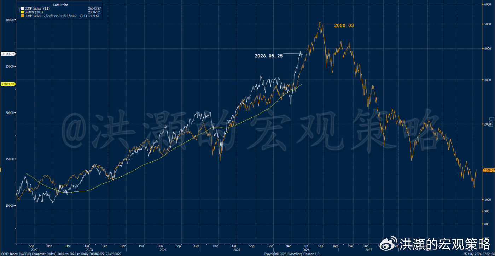
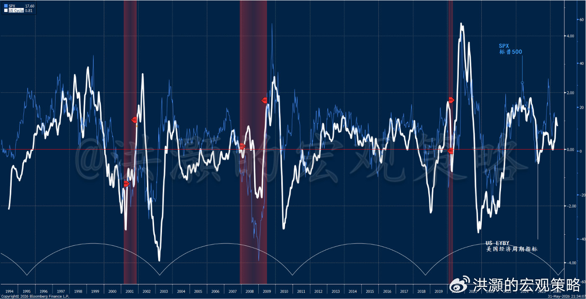

> 来源：微博文章（付费）
> 作者：洪灏
> 日期：2026-06-06
> 链接：https://weibo.com/ttarticle/p/show?id=2309405306866300747875

# 洪灝：AI如潮水

AI泡沫要破灭了吗？

坐在从福州返家的高铁上，窗外乌云密布，极目旷野，草木似乎被低气压牢牢按住，纹丝不动，一幅山雨欲来的风景。上一次来福建，去的是泉州。那时伊朗战事刚起，西方新闻的渲染让投资者以为一夜之间便可分出胜负。然而三个多月过去，战事依旧，谈判中断，特朗普的口术在冰冷的现实面前愈发苍白。福建这块福地给人的印象，向来是交易彪悍、"赌性坚强"，也无怪乎中国最好的制造业公司、消费品公司，以及一众亿万富豪，都发源并集聚于此。在这样充满博弈气息的空间里，或许正是对当下美股泡沫进行一番批判性思考的好时机。

昨夜，美股终于迎来了久违的暴跌。纳指一夜之间下跌5%，单日下跌的绝对点数创下有史以来之最，没有之一。标普500也遭遇了有史以来第十二大的周五单日暴跌，回调逾3%。其余十一次周五大级别暴跌，均发生在2020年疫情时期和2022年美联储史上最激进的加息周期中。华尔街有句老话说得好："没有一次暴跌是在周五结束的。"一般而言，接下来的周一和周二，美股市场都会收跌。

同样是昨夜，美股隐含波动率一夜之间从16以下跳升5个点至21。这是2024年以来首次，也是历史上第6次VIX出现如此表现。其中两次分别发生在1990年和2018年，此后一周美股均收跌5%至6%。这一切很可能拜昨夜史诗级的期权交易行情所赐——美股期权成交量创出历史新高。史诗级的成交量，必然推动期权隐含波动率大幅飙升。

这一系列触目惊心的统计数字都表明，昨夜的美股行情足以载入史册。这也是有史以来美股六月单日表现第十二差的一天。就连黄金这一最重要的避险资产也未能幸免，跌破了200天均线。在这条长期趋势线之下，对冲基金可能将顺势而为，量化模型机械性减仓。昨夜，美债、美股、黄金，金股债三杀，直杀得市场血流漂杵、人仰马翻。

其实，昨日亚洲时段，全球市场暴跌的征兆已渐浮水面。先是美国存储龙头博通业绩及管理层指引不及预期，股价重挫；紧接着，英伟达宣称将在其最先进的GPU架构中将DRAM用量减半，以压低成本，原因是DRAM价格高企、供应紧张；随后，韩国股市触发熔断，SK海力士暴跌10%。据说，由于价格剧烈波动，全球最大的单股两倍杠杆ETF需在周一进行再平衡（rebalance）。该ETF体量巨大，再平衡所需的成交量，将占到海力士日均成交量的很大一部分。如此，这种机械性的组合再平衡，势将进一步加大市场下行的压力。

放眼望去，尽管量化模型刷新了一连串史诗级的统计数据，但细察之下可以发现，除了博通的业绩与指引不及预期，其他基本面消息其实都是利好。甚至，若仔细审视博通140%的销售同比增长与70%的营业利润率，也很难将这样的表现归入利空。高盛呼吁客户逆势加仓。摩根大通则直接将覆盖特斯拉十年、坚定看空的分析师换掉，新分析师旋即上调了特斯拉的评级与目标价——不知是否为了在接踵而来的SpaceX史诗级IPO中，从马斯克那里分得一杯羹。

在两周前一份题为《洪灝：全球债市在预示着什么》的专属报告里，我们指出收益率飙升显示短期市场流动性边际收紧，美元指数技术性走强也预示着交易流动性吃紧，而量化模型则发出了强烈预警信号，有效时间窗口大约从五月下旬持续到六月初。这些判断，我也已在太阳系第三蓝色行星上与读者分享。

其间，全球市场依然罔顾系统性结构脆弱的信号，逆势而上。一些读者纷纷留言，认为我们的模型不再有效。当然，在市场涨声一片、令人怀疑人生的时刻，客观理性的声音往往被淹没在牛市的喧嚣之中。一夜之间，交易员从在光里站着，变成了光着战着。我在五月底的凤凰湾区峰会及其他会议上，也讨论过此次泡沫预警。我关于泡沫讨论的相关视频，仅在脸书一个平台上就获得了数百万播放量，是本届凤凰峰会中播放量最大的视频。

现在最迫切的问题是：美股泡沫就此见顶了吗？交易员接下来该如何应对？

---

**以下内容仅V+会员可见**

昨夜，美国经济的基本面堪称韧性十足，新增就业人数居然是市场共识预期的两倍，前值也获上修。显然，分析师低估了美国经济的强势，以及AI相关资本支出及其产生的溢出效应。然而，如此强劲的就业数据，也增加了市场对沃什年内加息的押注。市场现已计入美联储年内至少加息一次。我们此前讨论过，沃什的货币政策理念偏向降息与缩表。很难想象沃什会选择加息叠加缩表，这套组合杀伤力过大，被美联储最终采用的概率极低。与降息缩表相对应的组合是加息扩表。如今，沃什迫于通胀压力和经济强势，不得不考虑加息。如此一来，缩表这一对资产价格杀伤更大的工具，被祭出的概率将大幅降低。特朗普也没有忘记刷一下存在感，马上发推称："我要把降息与否的决定留给沃什。"其实，货币政策本来就不是特朗普可以决定的。

两个月前，我分享了一张2026 vs 2000的图。我们根据不同市场阶段的走势、宏观背景与国际政治格局，对标普和纳指在历史上的不同阶段时期的表现进行了拟合，发现2000年与当前市场走势的拟合度最高。前几天我再度更新模型，发现两个时期的轨迹依然非常接近（如图）。

从图上看，若当前趋势得以延续——我们暂时也无法认定这一趋势会戛然而止——那么美股泡沫的最终崩裂，大约将出现在三个月后。换言之，未来三个月是观察美股泡沫破灭的关键时间窗口。尽管如此，需要再次强调，AI泡沫的崩裂与AI科技革命完全不可混为一谈。即便美股AI泡沫破灭，也无法阻挡AI技术的革命。我们正在经历的AI技术革命，很可能是自第一次工业革命以来最重要的技术性飞跃。

那次工业革命实现了能量通过蒸汽机的转化，而这次AI革命将实现信息向智力的转化、碳基向硅基的进化。人类很可能从简单的智人，进化为全能之人。这种生产力的飞跃，暂无法用数字计算，也难以用语言表达。因此，倘若泡沫崩裂，我们会将其视为一次金融市场的调整，而非AI革命的失败。即便AI泡沫出现调整，也无法迟滞AI技术的进步。

在以上的讨论中，我们同样谈到美国经济的基本面，目前仍韧性十足。这体现在我们的美国经济周期指标从年初略低于平均线的位置，回升至长期平均线之上。也就是说，类似PMI指标重新回到了50荣枯线之上。在基本面依然强劲的情形下，我们认为美股泡沫即刻轰然倒塌的概率不大。但为避免误会，仍要强调：当下的行情已逼近鱼尾。泡沫的最后一段往往令人眼花缭乱、欲罢不能，然而所有泡沫终将破灭，出来混总是要还的。其中的细节与影响，请容我在下半年展望报告中再作详论。泡沫多暴跌，这次也将不会不一样。短期，技术调整将使疾速、短促而动荡的。

挥笔至此，高铁站上，低气压愈发凝重。六月酷暑之中，我心急火燎地寻找冷饮，以平息心口之火。可能是周末的缘故，商务候车室里人影寥寥，但在打开冰箱、手指触碰到冰可乐罐头的那一刹那，寒冰彻骨入心，整个人一下子安静了下来。这真是一个难以乱耳劳形的福地。

祝大家六六大顺、六运常开。

洪灝
2026.06.06
发布于 中国香港
