> 来源：微博文章（V+付费）
> 作者：洪灝的宏观策略
> 日期：2026-06-11
> 链接：https://weibo.com/ttarticle/p/show?id=2309405308522966679655
> 备注：2026下半年展望上半部分（1/2），下半部分将于2026-06-12发布

# 洪灝：2026下半年 | 2000年泡沫的回响 1/2

赤马红羊，丙午之火，炼成了伟大的泡沫。

## 赤马红羊逆天改命

2026年的上半年，市事犹如白云苍狗。伊朗战争及其引发的油价飙升，叠加全球西方政府债券收益率的急剧上行，以及这场似乎突如其来的科技硬件与人工智能股票泡沫——这一幕幕，终将被载入现代金融史册。初夏的这个十字路口，已然成为今年最具决定性意义的时段。

提笔之际，中东热战胜负未分，美联储在一片争议声中迎来了新任主席；人工智能驱动的半导体股票及其他科技硬件所引领的超级周期扶摇直上，全然不顾霍尔木兹海峡重启的剧情不断反转。此刻，惊涛拍岸，乱云飞渡，更兼亚洲货币格局迎来历史性重塑，使得市场前景愈发扑朔迷离。雪泥鸿爪之间，依稀可辨百年大变局的脉络。

近日，美国十年期长债收益率已攀升至2007年以来的最高水平，日本三十年长债收益率更是飙升至有史以来的峰值，甚至高于中国同久期债券。这些长端收益率，素来是全球资产价格估值的定盘星。全球无风险收益率如此急剧地飙升，其对于风险资产定价的冲击，已令人无法视而不见，更难以一笔勾销。

回首去年十一月，在展望2026年经济和市场时，我曾指出今年是中国历法上的"赤马红羊"之年。天干地支皆为火象的丙午之年，最易催生出一个"伟大的泡沫"——投机者在技术革命的宏大叙事、信贷充沛的流动性环境与金融创新的资本市场里，一个接一个地丧失平素的客观理性，将数据分析和量化模型的结论抛诸脑后，最终孕育出史无前例的泡沫。在这样的市场中，理智者永远正确，疯魔者永远赚钱。然而，随着坚守理性日益煎熬，随众疯魔的风险也水涨船高。不曾发生的叫做"概率"，而切切实实落在自己头上的，那才叫做"风险"。

当然，我们并非仅仅倚赖中国古典哲学来预测这场"伟大的泡沫"。古人对周期的观察与思考，给予了我们纵横古今的独特视角。去年十一月展望2026年时，我们根据黄金与股票的长周期相关性，明确提出了一个不刊之论：传统的避险资产黄金与股票同时飙升，正预示着一幅山雨欲来的景象（图1）。毕竟，上一次出现如此风险资产与避险资产齐涨的盘面，还要追溯到1929年前后。夙兴夜寐，曷胜唏嘘——历史的韵脚，总是惊人地相似。

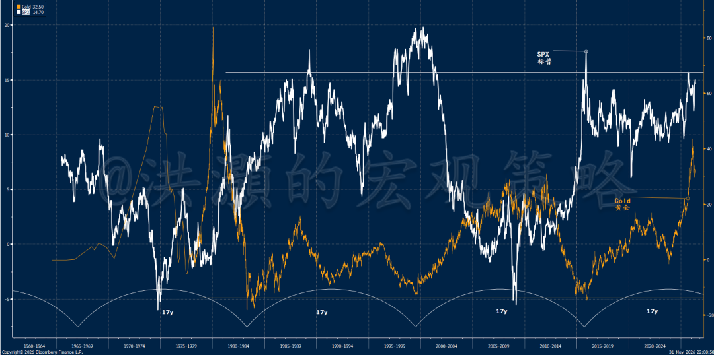
*图1：黄金和股票同时飙升，一幅山雨欲来的风景（去年十一月原标题、原图更新）*

在我的量化周期理论里，一个长周期为35年，约等于是个3.5年的小周期的叠加。两个35年的长周期大约等于一个70年的康波周期。上一个世人皆知的周期底部是2009年美国的次贷危机。当下的2026年距离这个2009年周期的底部大约17年，正好是在35年长周期的顶部，并且和今年丙午火年相吻合。周期的顶部充满了各种可能性，最容易催生伟大的泡沫，更勿论是这赤马红羊之年。这样的年份甚至可以让人逆天改命、脱胎换骨。

在去年十一月发表的展望报告《洪灝：2026年展望——持而盈之》里，我如是写道：

"直觉上，无论美联储通过买短期或是买长期的美国国债来重新扩表，短期内对于资产价格的上涨都是正面的。买长期国债将导致长期国债利率走低，利好资产价格上涨，但是对于回购市场利率的控制可能就岌岌可危了。而我们认为的更可能的情况，就是先买入短期债券进行财政货币化，平抑短期回购市场波动的风险。这时，美联储的资产负债表的久期其实是不变甚至缩短的。如是，短期内美联储通过买短重新扩表会被市场大众认为是一项利好消息，导致资产价格最初膝跳反应式地上涨。然而，当市场全面消化了这个消息之后，美国市场将开启下跌模式。"

## AI投资周期

今年，令投资者困惑的是，美股似乎无视各种在一个正常的年份里的利空，其上涨的势头如入无人之境。尽管伊朗战争导致美股出现了为期约一个月的深度调整，比如半导体在三月的几个星期内暴跌了近20%，但是在特朗普的公然"喊单"的市场操纵之下，美股赫然创出了历史新高，而基本面的韧性也彰显表面。五月的就业数据居然多出了市场共识预期近一倍，而之前月份的就业数据也上修了。

由于篇幅原因，这是2026年下半年展望报告的上半部分。我们明天2026.06.12将发表报告的下半部分。

---

*以下内容仅V+会员可见*

---

如果我们比较一下，今年以来美联储资产负债表的变化情况和资产价格的走势，我们会发现美联储的资产负债表确实如我去年十一月报告讨论的一样，一直在扩张，尤其是买入短债的操作（图2）。这个观察，应验了我们去年十一月在展望报告里的预测。然而，虽然美国民众对于股市未来的表现的信心空前的高涨，但对于经济的基本面的预期则跌倒了历史的谷底，导致对于股市和经济之间的预期差飙升到了历史最高点（图2）。严格意义上，这种对于股市的前景和经济基本面预期如此剧烈的割裂，就是定义泡沫本身最经典的阐释。

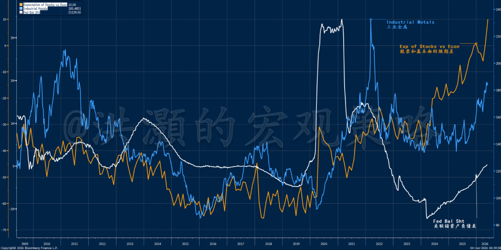
*图2：美联储继续扩表，助力风险资产；对于股市和经济的预期差达到了历史最高——一个经典的泡沫*

令人惊讶的是，持续了近百日的伊朗战争居然对于全球经济的影响并没有像预期的那般显著。至少暂时如此。以前中东战事纷纷，油价早就上200美元了（在经过通胀调整之后）。然而，这次伊朗战争打响之后，油价短暂地上冲到120美元之后就开始快速地回落。尽管历史经验束缚着我们对于高油价的预期，但是四月初的时候我们的量化模型却反"常识"地显示油价即将到来的暴跌。我们在蓝色行星上也及时地与读者分享了这个模型的预测。

由于中国是一个能源进口国，伊朗战争对于中国的负面影响、尤其是对于高油价对于中国制造业和出口的影响，市场都异常忧虑。然而，一季度中国的GDP增速达到了5%，大幅超出了市场的预期。中国的港口吞吐量，一个中国出口的领先指标，年化增长大概率要超越历史上出口最强2025年。这一年，中国创造了史上最高的、1.2万亿美元的出口盈余。

中国内地的油价也在政府的补贴下大致维持稳定。当下油价的相对稳定很可能是因为中国重启了烧煤发电之举，同时开始释放总量高达十几亿桶的原油战略储备，来平抑油价的波动性。而沙特则开始让原油出口通过输油管道绕道红海港口出海。再叠加俄罗斯原油出口禁运的暂时取消和美国原油产量的激增。这些因素都导致了这次伊朗战争对于油价的影响迄今相对稳定。

然而，在我们对于现状暖暖姝姝之前，我们也要看到当下全球原油战略储备正在以史无前例的、每天1000万桶的速度被释放。如果伊朗战争在未来几个月内不能得到及时的解决，那么油价将最终反映原油的库存情况而再次飙升，同时油价的期货曲线就不会像现在这样期现倒挂了。同时，即便是战争结束、海峡重启，油价也很可能居高难下，因为恢复航运需要时间、部分产能遭到了战争的破坏，更勿论由于缺油对于今年春天化肥生产的严重影响。现在，市场交易员选择性地忽略高油价对于全球通胀预期的风险。这个悬而未决的矛盾也为下半年市场的动荡埋下了伏笔。

如果油价居高不下而最终影响到通胀预期，那么新上任的美联储主席沃什的货币政策选择就会左右为难了：一方面沃什要履行美联储保持物价稳定的目标，通过加息来平抑通胀预期；另一方面，沃什还要履行美联储保持市场稳定的目标，并为他老丈人、美国犹太人协会的主席、经典化妆品家族的教父、特朗普真金白银的金主在中期选举中助特朗普一臂之力。这两个目标显然是自相矛盾的，加息、尤其是在市场估值非常昂贵因此异常脆弱的情况下，容易导致市场波动，而大幅的市场波动一旦发生，就很可能将成为特朗普中期选举的阻力。同时，加息也与沃什的货币政策初衷、竞选上任时表达的"降息+缩表"的政策组合格格不入。

当下，市场认为沃什今年年底前将至少加息一次。如是，美股市场必然会有所反映。当然，美国经济当下显示出超强的韧性。这是由万亿美元级别的AI资本支出而推动的（图3 和 4）。如此量级的资本支出，叠加溢出效应，必然导致对于上游大宗商品需求的激增（图5），使得美国实体经济需求增加，甚至过热。叠加高油价对于通胀预期的影响，美联储加息的概率将进一步上升。

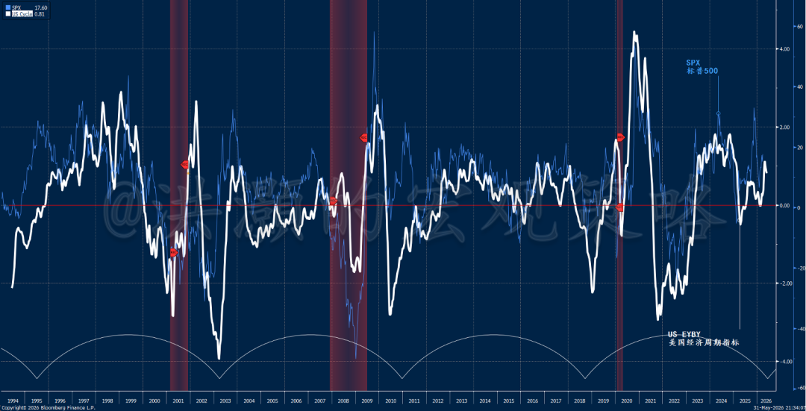
*图3：美国经济周期韧性——AI相关的资本支出延伸了美国经济周期*

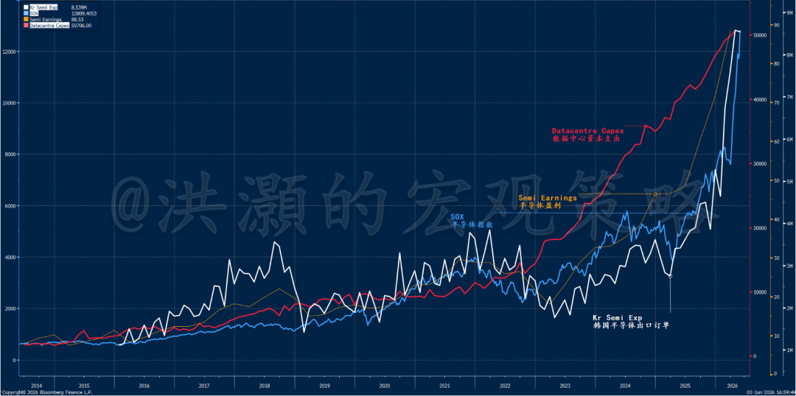
*图4：韩国半导体出口订单、数据中心资本支出、半导体板块盈利、半导体指数*

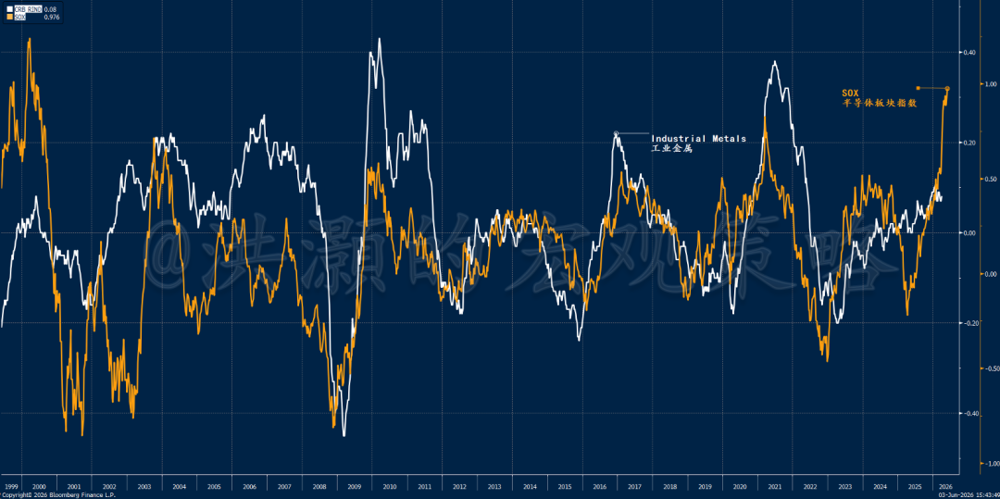
*图5：AI超级泡沫就是金属超级周期*

我们的量化模型显示，不管油价高企与否，美国通胀预期在未来几个月内大概率上升（图6）。这是因为过去大半年流动性条件的变化是通胀预期的领先指标。从历史相关性来看，通胀预期将继续上升。请注意，这个图是我们在去年11月展望今年的时候，为读者展示的。那时还没有任何战争和油价的迹象。前几次的加息市场或者还可以解读为是对于经济强势的反映。但如果需要连续加息来控制美国的通胀预期的话，那么市场就很难置若罔闻了。毕竟，2000年的时候，美股互联网泡沫也是在美联储连续第五次加息的时候才轰然倒下。

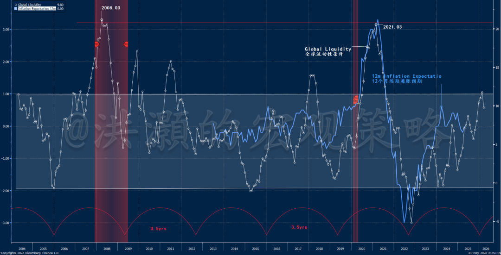
*图6：无论油价下降与否，未来数月美国通胀预期大概率都将上升*

## 黄金白银史诗级行情启示录：泡沫破灭的条件

沃什正式走马上任的另一个受难者，是黄金和白银。过去几年里，黄金从我三年多前强烈推荐时的1,000美元出头，到今年二月的时候最高飙升到了5,600美元，而白银也从10美元出头一路狂飙到了121美元。这样令人瞩目的升幅其实一点也不比现在炙手可热的AI股票逊色。相对于最近的存储股行情，其实黄金白银的走势也一点都不让分毫。然而，我经常说，"抛物线式的上涨必然导致抛物线式的下跌"。

因此，把黄金白银史诗级别行情的终结归咎于沃什的货币政策哲学，实有强加于人之嫌——虽然黄金白银的历史性暴跌与沃什就任的时间点吻合。毕竟，沃什的思路一直都是公开的，而他在过去十几年几个重要的市场拐点对于政策选择的投票也是和其他理事的思路大相径庭的。沃什如此特立独行的理事的思路，也在特朗普提名的过程中经过了国会的论证和答辩。因此，市场突然对于沃什货币政策立场的担忧并因此为借口而拋售黄金白银，实在是说不过去的。

今年一月二十九日，我对于黄金白银的史诗级暴跌在蓝色行星上为读者做出了预警。随后的一天里，白银暴跌了17%。之后，我们一直在耐心地等待着黄金白银下行趋势的耗尽，并重拾长期的上升趋势。近期，一些技术指标，比如德马克的13，显示下行趋势的压力已经接近了尾声。然而，由于黄金白银之前剧烈的上升势能需要时间消化，同时我们的流动性指标，也就是黄金白银走势的领先指标，开始回落（图7 和 8），令我们认为下行压力的完全消耗殆尽还需要一段时间。

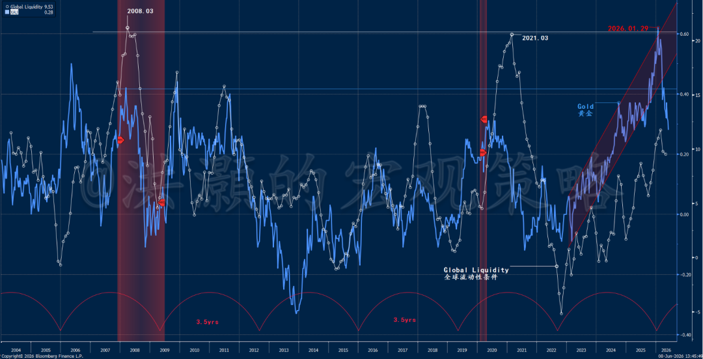
*图7：流动性条件开始边际转弱，黄金下行压力尚未耗尽*

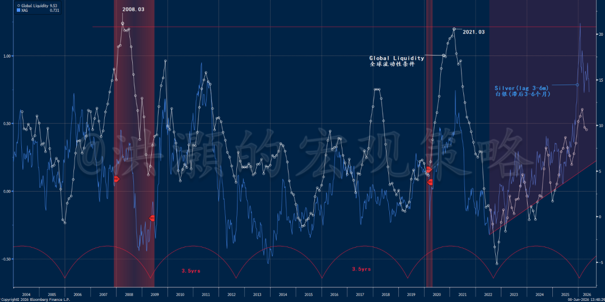
*图8：流动性条件开始边际转弱，白银下行压力尚未耗尽*

尽管如此，黄金白银今年史诗级行情到最终泡沫的裂痕还是给其后此起彼伏、波澜壮阔的科技半导体板块行情留下了许多帮助我们对于当下的市场进行前瞻性预判的线索。

1）抛物线上的上涨必然导致抛物线式的下跌。这是由市场价格本身的内部结构而决定的。这是因为，随着市场价格的不断加速上升，交易员评估盈亏的时间窗口将会越来越紧迫，而市场价格出现更高回报的概率则越来越小，并不断地趋向概率分布曲线的尾部。最终，出现更高的回报的概率逼近现实世界的几乎不可能——犹如打掼蛋的时候摸到满手一个花色的顺子一样——概率微乎其微。交易员在回报率快速萎缩的预期下同时集体出逃，势必造成市场价格势能的崩塌，俗称市场踩踏事件。这就是金融市场里的市场"挤提"事件，是市场轧空的镜像。这种价格势能的崩塌甚至不需要基本面条件的变化（图9）。

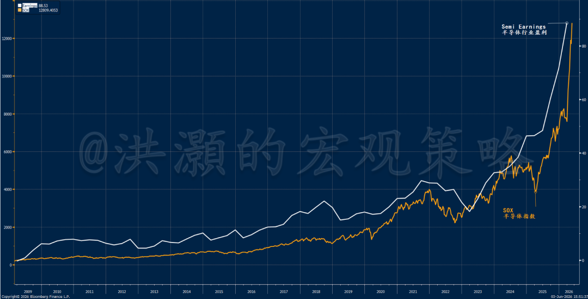
*图9：半导体板块抛物线式的上涨，伴随着盈利的飙升*

2）泡沫的崩塌必然与杠杆资金的突然断裂密切相关。虽然没有全面的数据细节，我们可以从一些新闻叙事里，观察到包括场内的融资、杠杆ETF和期权交易在内的市场杠杆是非常高的。然而，今年以来，CME连续数次上调黄金白银期货的保证金要求，人为地暴力拆卸市场交易型杠杆，可以说是刺破这次黄金白银泡沫的推手。目前，我们觉得海外监管再次插手股票市场的杠杆交易概率不大，但是美联储的加息情景意味着市场资金成本的上升。而这次加息的影响市场似乎尚未计入价格。

我们用市场数据模拟了美股市场期权交易产生的GAMMA伽马敞口（图10）。我们看到在这次四月以来的历史性反弹之前，GAMMA伽马风险敞口转负，在特朗普TACO之后（请阅读2026.04.08《洪灝：史诗级TACO》），增强了市场反弹时候的价格势能——趋势逆转之后，价格上升不断加速。然而，这种抛物线式的上涨必然有大量的杠杆资金参与。顺便说一下，这次半导体板块的行情是一次六倍方差事件，是一次史无前例的行情。

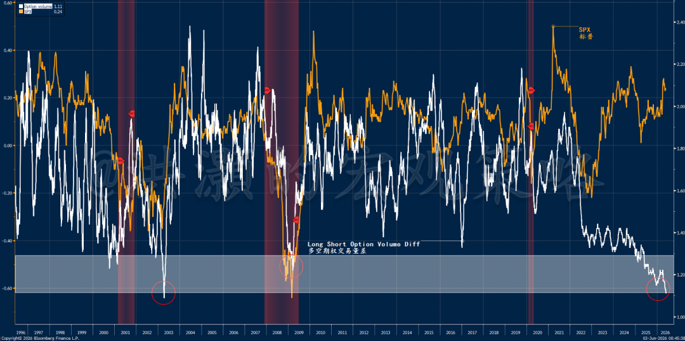
*图10：美股市场多空期权成交量与2002年历史底部相当，与标普走势历史性背离*

3）在正常的估值倍数范围内，估值偏高或者偏低并不会产生有效的交易信号。估值贵并非价格下跌、泡沫破灭的原因。但是当估值趋向极端的时候，那么一定是泡沫破灭的诱因之一。在估值极端化的背景之下，任何一次风吹草动、任何一个新闻头条都有可能成为刺破泡沫的那一根针。甚至，在估值极端高昂的时候，好消息也可以是坏消息。

当然，金银并无估值可言，因为其本身并不产生现金流，因此现金流折现无从谈起。从交易的角度来看，金银都是彻头彻尾投机的资产类别。因此，金银投资的本质，就是对于未来收益率的预期。而图7和8显示的金银收益率的极端化，使得这个未来收益率预期大幅的降低，最终导致价格大幅的下行。在收益率均值回归之后，金银必然迎来一波新的、持续约两到三年的行情。

4）泡沫出现裂痕到市场明显出现调整的时间窗口，往往需要至少几个月的时间，才能把之前的泡沫盈余消化干净，让市场找到立锥之地。比如，2015年6月中国的5000点泡沫的破裂到结束大约用了一年左右的时间，到了2016年六月才逐步出清；2021年的半导体/互联网泡沫也经历了不断大约一年多的时间，直至2022年四季度，才逐步出清。而日本90年代的房地产泡沫则长达"失去的二十年"；2000年纳指的互联网泡沫也是经历了超过二十年，才再次回到了2000年时期的高位。

## AI股票全面泡沫化

当下，没有任何主题比人工智能更能主宰全球市场的浮沉。在分析下半年展望的时候，这个中观的行业话题无法回避。然而，在一个人均半导体分析师的时代，我们要看到市场没有计入价格的因素。

半导体行业正处在它的高光时刻。存储芯片股年初至今已飙涨逾两倍多，市场共识认为，半导体这个行业终于挣脱了自身周期性的万有引力，已经从一个强周期行业变成了一个为客户量身定制、通过长协来锁定订单需求和价格的、可以穿越周期的行业。因此，一些华尔街腰包鼓鼓的大行认为现在可以把半导体的估值方法从市净率像市盈率改变。毕竟，现在这些半导体公司的盈利可见度已经大幅增加了。

然而，从业近三十年的我，似乎又嗅出了一股熟悉的味道。曾记否，在二十多年前那次千禧年互联网泡沫的时候，由于很多互联网公司的市盈率过高，分析师纷纷认为应该用PEG市盈率与增长的比率来反映这些公司告诉增长的前景。当然，未来的增长速度都是分析师自己做梦编出来的。更有甚者，分析师看到当时很多互联网公司根本就没有盈利因此算不出市盈率，就提出了EV/EBITDA的估值方法。

最后，对于一些什么都没有的公司，分析师只好硬着头皮用市销率来估值。反正，就是把估值的分母从收入表的最底层移到了最顶层——因为当时很多公司除了销售收入之外，其他盈利项目基本没有，还拼命亏钱。有的个案，甚至销售收入也是虚构的。比如，三个公司互相买卖，用关联交易来虚构销售收入。

眼下流行的共识简单得令人难以抗拒：人工智能对存储的需求远超以往任何一轮技术浪潮；供给端受到结构性约束；长期协议锁定了未来多年的盈利可见度；而个位数的市盈率，让这些股票显得无比便宜（图11）。表面上，这个估值方法和看多的逻辑令人无法反驳。同时，在当下通胀预期飙升和伊朗战事未了的、充满了不确定性的大环境里，这些半导体公司的长协所带来的盈利可见度和各位数的市盈率反而给一众投资者带来所谓的"确定性"。当然，这种确定性并非完全虚构，但是它所建立的逻辑基础和推论，还是值得商榷的。

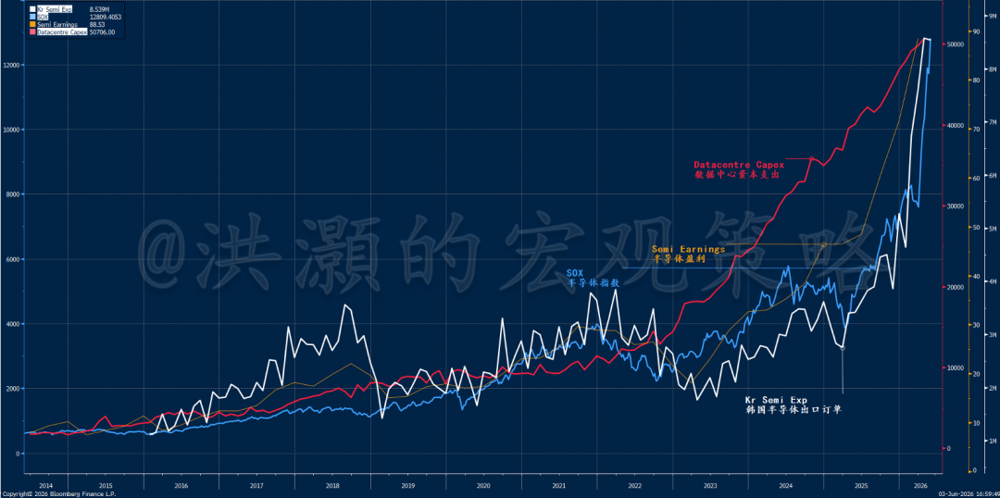
*图11：韩国半导体出口订单、数据中心资本支出、半导体盈利、半导体指数*

然而，虽然长协的确锁定了部分产能，也就是未来的需求，但是我们并没有看到签了长协的公司对于这些需求定价的论述。换言之，我们并不知道是否每一个长协都既锁定了供货量，也锁定了产品单价。由于许多半导体公司对于这个未来的产品单价都讳莫如深，我们有理由相信并非所有的订单都是锁定了价格的。因此，如果未来价格由于供需关系再次发生变化的时候，这些半导体公司的盈利就要相应调整，同时估值倍数看上去也将和现在完全不一样。比如，图11显示半导体价格指数的变化领先大型纳指走势长达6-12个月。但是我们半导体价格指数上升的势头这个领先指标远远地慢于纳指旱地拔葱之势。

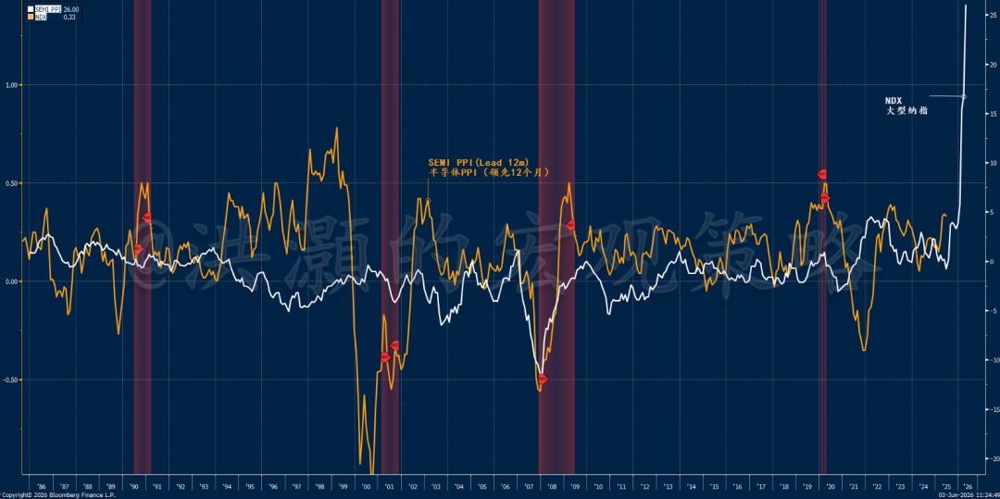
*图11：半导体价格指数领先纳指，但纳指似乎过度反应*

殷鉴不远，其实在2021年汽车芯片短缺期间，许多汽车制造商由于FOMO芯片短缺，不得不和许多车用芯片公司签订长协。然而，到了2023年，每一家主要的车用芯片供应商都发布了盈利预警，因为车厂开始消耗短缺时期囤积的内部库存，而不是履行那些远期的采购承诺。在2017年存储短缺潮消退的时候，此前的长期采购协议的订单价格随着市场价格在两三个季度内跌去四成以上，并没有"撑住"。

这两个活生生的例子都说明了，其实长协并没有产生真正的终端需求，因此也就没有真正的锁定需求。市场总是有自己的方法解决供需失衡的问题，或者是因为价格过高而减少使用量——比如日前老黄的宇宙最大的公司宣布在其最先进的模组将存储的使用量减少一半，来应对价格上升的压力；或者市场因为短缺而进行技术革新和突破，在现有的资源在优化之后可以应对更大的需求——比如中国的Deepseek Moment和"韬定律"。

当然，由于AI技术的进步，当下AI大模型都需要应对long context window长语境内容。简单的说，要让AI产生记忆，就需要更多的存储；要AI加快运算速度，除了更好更快的GPU之外，还需要更快的记忆传导；要做Agentic AI代理AI，让AI控制计算机里的多程序同时工作，那么不仅仅需要GPU，还需要CPU。换言之，对于半导体芯片的需求，是由于AI技术突飞猛进而产生、拉动的。如是，长期看来，那些长协签下的半导体需求，似乎应该是真的。

那么，为什么估值会有顶？毕竟，以前的估值顶部未必是现在估值的顶部。让我们用逻辑来推理这个问题的答案。如果科技发展的速度越来越快，那么科技到达人类极限的时间也就越来越短了。如是，估值倍数应该被压缩而不是扩张。就像你不能给80岁的老人放30年的房贷一样，因为剩下的预期寿命大约只有20年。然而，如果AI科技进步最终完全打破人类的极限，人类社会的经济不再是建立在有限资源使用的最大化的前提下呢？如是，那么估值无限高和估值为零就完全没有差别。这时，人类社会不再受到有限资源供给的束缚，产出无限最大化。这时，我们投资不需要看估值，甚至不需要投资。在这种情景下，物质产出的最大化让人类社会进入共产主义社会。

因此，我们认为在当下的宏观条件下，AI的估值还是应该有极限，同时受制于历史区间。本周，人类历史上最大的IPO、马斯克的火箭公司上市进入倒计时。在最近的一次极品摩根举行的峰会上，呆萌吉米主持了一个对于马斯克的现场采访。马斯克对于未来细节的预测和描绘，语惊四座。马斯克认为他的火箭公司将把每公斤货物运上太空的成本降低到现在的1%，不到30美元，比跨洋的运费还要便宜。

然后，马斯克将把数据中心直接建立在太空，以太阳能发电并利用太空的真空自然冷却从而节能。同时，他的火箭公司将发射无数的近地卫星，把数据中心处理好的数据直接发回地面，节约了大量的存储空间。这样，马斯克勾勒出来一幅成本远远低于现在的算力结构，但是算力将是地表现有的和未来在建的、所有的数据中心的算力总和的1000倍。这绝对不是什么科幻小说。这个计划已经在进行之中。言语之间，马斯克兴奋的心情溢于言表。毕竟，这是一笔价值几万亿美元年收入的大买卖。而对于我们投资人来说，这是对于现在地球上所有的数据中心的商业模型的根本颠覆。

三月，在伊朗战争的阴霾之下，半导体板块出现了一波近20%的调整。然而，市场对于战事淡然处之，半导体板块很快就收复了失地，并在各种长协和AI相关的资本支出的利好影响之下，在短短的一个多月里就上涨了逾50%。韩国的存储双雄更是一条直线地往上拉。这是近代金融史上最轰轰烈烈的一波上涨。然而，半导体行业的基本面不太可能在如此短的时间里发生如此翻天覆地的变化，而变化的是由宏大叙事激发的投资者对于未来的憧憬和投机情绪的白热化（图12）。或者说，半导体需求的变化已经反映在股价的飙升之中。

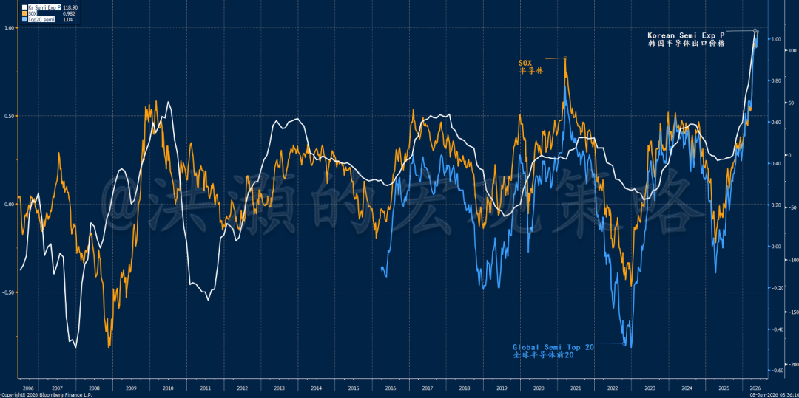
*图12：全球半导体板块史诗级行情*

逻辑上，如果盈利如此确定，这些半导体公司的市盈率难道不是应该更高而不是像现在个位数这样更低吗？为什么市场不愿意给这些公司更高的市盈率估值呢？我们都知道，其实周期性板块的估值在周期的顶部往往是最低，而反之则反。也就是说，尽管宏观叙事发生了重大的变化，但是低估值显示市场依然把这些半导体公司看做是周期性行业，并没有改变对于半导体这个行业的看法。同时，各位数的市盈率还显示了这些公司正处在半导体超级周期的顶部，而不是底部。如是，周期性公司迟早将不得不遵守周期轮回的规律而回落，而不是不断地往上无限生长。

那么，如果市场对于半导体板块估值的逻辑其实没有变，那么又为什么市场会出现这种几乎90度角旱地拔葱式的暴涨呢？我们认为这是美股市场里的交易结构变化所致。首先，美国的退休基金401K增加了对于股票配置的要求。其次，美股市场里的期权交易量现在已经超过了股票现货的成交量。这时，券商发行的期权导致券商不得不对冲自己的衍生品风险敞口，并出现"负伽马效应"——股票越涨越买，越跌越卖。与401K portfolio rebalance组合再平衡一起，这两股合力成为了股票走势的加速器和放大器。美股市场还新发行了还有很多杠杆式ETF。而特朗普的TACO交易和美联储的扩表也为风险资产的下行风险兜住了底。

就这样，一个史诗级的泡沫就诞生了（图13）。

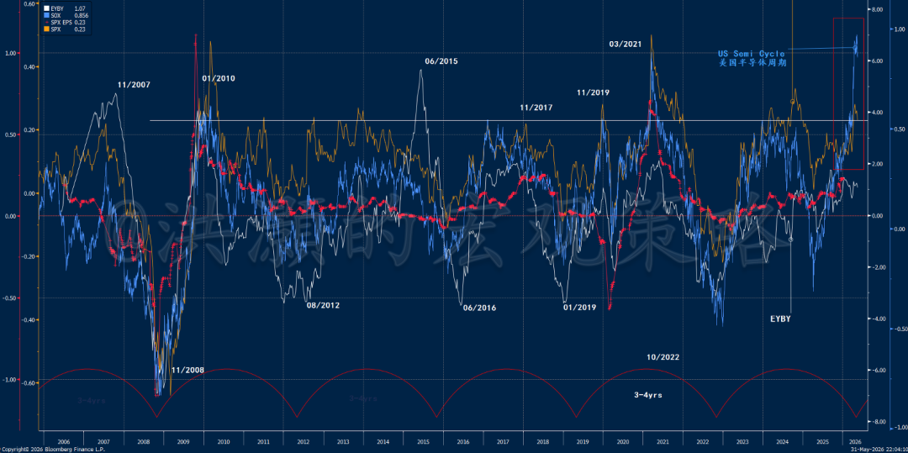
*图13：半导体史无前例的泡沫*

篇幅较长，未完待续。明天2026.06.12将发布2026年下半年展望的下半部分，论述泡沫如果崩裂的话，运行路径和时间，以及交易策略和机会。

洪灝
2026.06.11
发布于 美国
