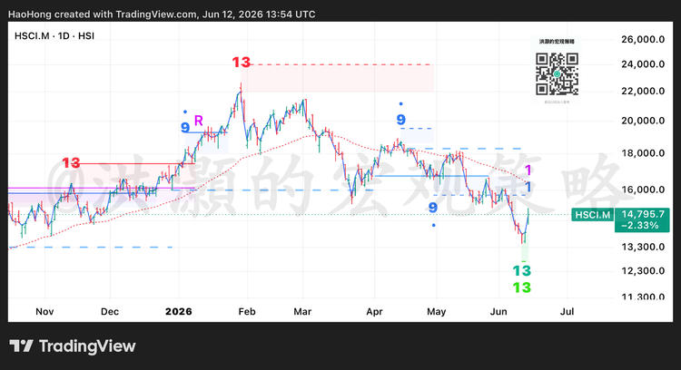

> 来源：知识星球「洪灝的宏观策略」
> 日期：2026-06-12
> 链接：https://t.zsxq.com/mlVt0

## 正文

恒生大宗商品指数日线 德马克13。但是周线、月线还没有信号。

## 配图

图表要点：
- 标的：HSCI.M（恒生综合行业指数-原材料），日线
- 当前价格：14,795.7（-2.33%）
- 从2月高点约24,000跌至当前水平，跌幅约38%
- 日线出现 DeMark 13 计数完成（趋势衰竭/潜在反转信号）
- 周线、月线尚未出现信号，意味着更大级别下跌趋势可能未结束

## 解读

DeMark 13 是 Tom DeMark 序列指标中的趋势衰竭信号。日线出现13说明短期下跌动能已衰竭，可能出现技术性反弹，但周线/月线未确认意味着中长期趋势仍向下。结合洪灏此前关于沪金 DeMark 13 的评论逻辑（"可以开始关注"），此处信号级别更低（仅日线），应以观察为主。
