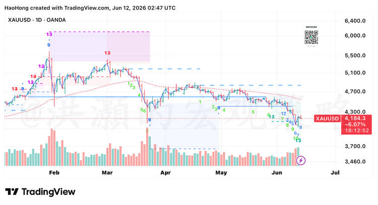

> 来源：知识星球「洪灝的宏观策略」
> 日期：2026-06-12
> 链接：https://t.zsxq.com/CWcdX

## 正文

黄金日线再次出现德马克13。但是由于前两天市场传言印度央行抛售黄金（印度央行已经辟谣）产生的巨幅的抛盘，这次的德马克countdown sequence是跳跃的（上次也是），因此认为信号强度不是最大的。

今天的下半年展望的下半篇也详细讨论了黄金和白银的趋势。

## 配图

图表要点：
- 标的：XAUUSD，日线，OANDA
- 当前价格：4,184.3（-6.07%）
- 从2月高点约6,200跌至当前水平，跌幅约32%
- 日线再次出现 DeMark 13 计数完成
- 但 countdown sequence 是跳跃的（非连续），信号强度打折

## 解读

关键信息：
1. **DeMark 13 再次出现**：黄金日线动能衰竭信号，但非标准形态（跳跃序列）
2. **印度央行抛售传言**：已辟谣，但导致了巨幅抛盘，扭曲了技术信号的连续性
3. **信号强度有限**：洪灏明确指出"信号强度不是最大的"，与5/28沪金DeMark13（当时措辞"可以开始关注"）类似的谨慎态度
4. **下半年展望下半篇**：提到今天发布的展望文章详细讨论了黄金白银趋势（星球付费评论区有人提到"黄金白银的下跌势能尚未耗尽，可能还需要数月"）
