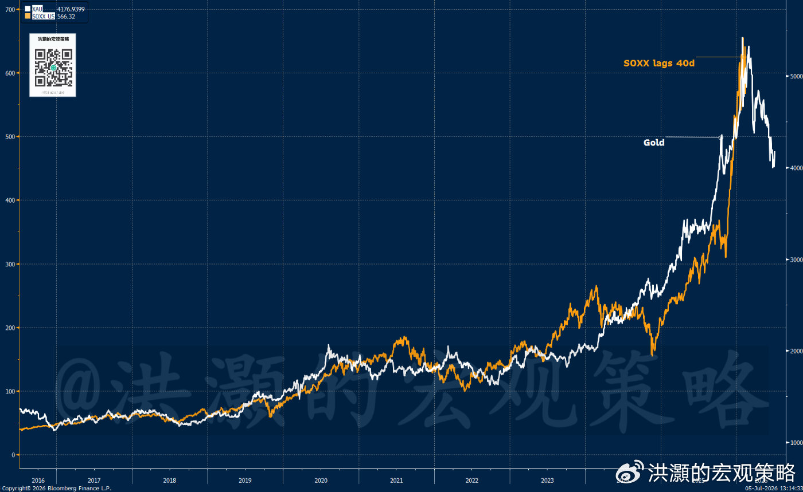
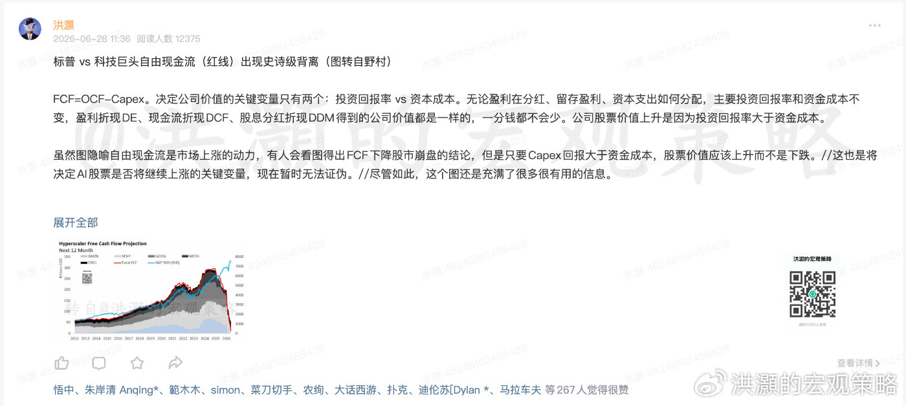
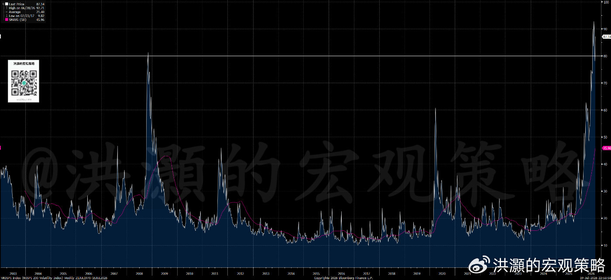
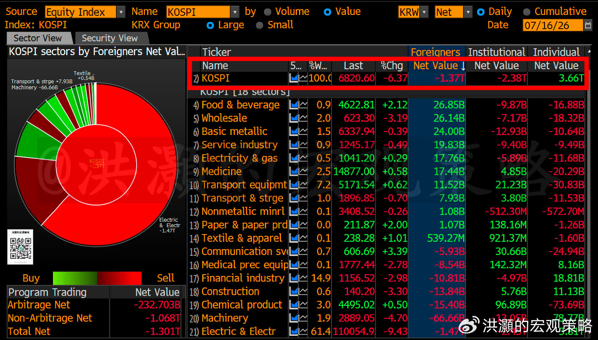
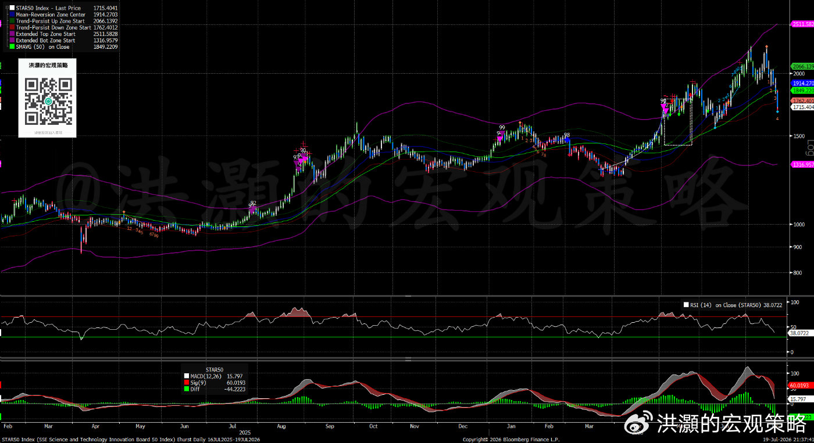
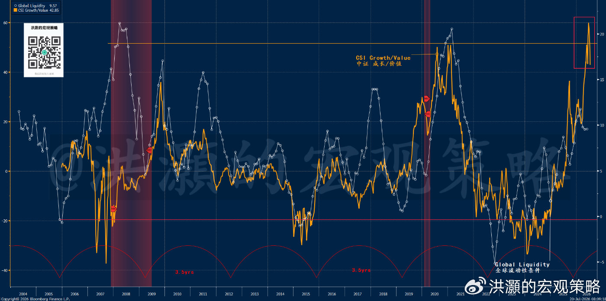
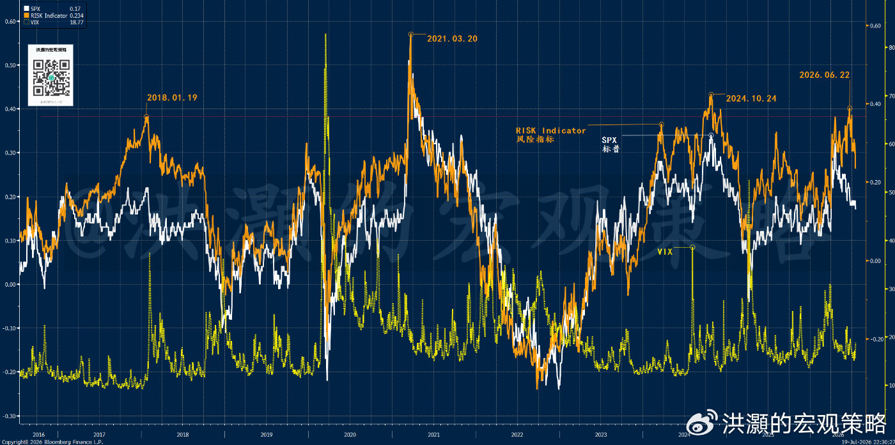

# 洪灝：韩国泡沫破灭意味着什么

> 来源：微博长文  
> 作者：洪灝  
> 发布日期：2026-07-20  
> 原文：https://weibo.com/ttarticle/p/show?id=2309405322681783550080

7月17日周五，市场原本期待最大的芯片制造公司以强劲业绩挽救全球半导体板块。然而，主要由一两家半导体公司支撑的韩国市场，在17个交易日内暴跌25%，较最高点跌去三分之一，构成有数据以来速度最快的韩国市场回调。

在此之前，我们已在蓝色行星、专属报告及6月11—12日发布的《2026年下半年展望：2000年泡沫的回响》中预警：半导体经历抛物线式上涨后，必然迎来抛物线式下跌。类似逻辑也曾用于判断1月30日金银史诗级暴跌的起点。

## 黄金与半导体的领先关系

图一：黄金 vs 半导体（滞后40个交易日）。

这一轮由AI叙事驱动的全球半导体上涨，本质是一场杠杆盛宴。去年11月的年度展望已预测2026年6月出现流动性拐点，6月下半年展望又更新了全球流动性条件模型。历史上的杠杆型泡沫——1929年美股、2008年金融危机及2015年A股——都从杠杆崩裂开始。

韩国监管近期提高保证金比例、推迟杠杆ETF发行，意在降低市场杠杆。但融资盘被迫清仓会压低价格；价格下跌又触发新一轮强平，形成反复的“补仓—抛售—再补仓”，直到杠杆恢复正常。

## 估值悖论：低市盈率与高市净率

韩国市场暴跌后的市盈率约6.8倍，低于2008年金融危机时期；但市净率约2.8倍，处于有数据以来最高水平。两种方法给出相反结论。

两家半导体公司利润成倍增长，却没有获得更高市盈率，说明市场怀疑当前增长能否持续。个位数市盈率更可能是盈利周期高点的表征。高市净率则更适合衡量风险：它反映未来资本开支尚未完全进入财务报表，而不是ROE可持续飙升。焦点在于大型科技公司的资本支出能否真正变现。

图二：除非ROE高于资金成本，市净率不会上升，反而会下降。

## 波动率见顶不再等于市场见底

若监管去杠杆是泡沫破灭的催化剂，那么去杠杆何时完成，将决定市场何时稳定。韩国市场隐含波动率已升至史无前例的高度，远高于2008年和2020年。

图三：VKOSPI一度接近100。

VKOSPI衡量未来30天预期年化波动率。读数接近100，意味着期权市场预期未来一个月每天都可能出现约6.3%的标准差级波动。6月24日和29日，VKOSPI分别升至约97.98和97.99，已是金融危机级别的尾部定价。

历史上，恐慌指数见顶往往与价格底部相近：2008年触及89、2020年触及82，两次都离韩国市场历史性大底只有几天。但本轮规律失效：VKOSPI两度创历史新高时，KOSPI仍在8000点附近，随后又跌至7月16日的6821点，跌幅超过15%，相隔整整三周且可能仍未见底。更反常的是，VKOSPI首次突破90出现在KOSPI单日暴涨8%的交易日。

这说明波动率飙升更多反映杠杆ETF机械再平衡导致的双向剧烈波动，而非单纯的恐慌情绪。因此，“波动率见顶=市场见底”的经验法则本轮并不成立。

## 去杠杆仍未完成

韩国监管披露的杠杆数据表明：显性融资余额从峰值仅下降11%，仍约34万亿韩元，只回到4月水平；信用融资占散户存管金的比例反而上升。债务在减少，但投资者现金安全垫下降得更快，实际杠杆率不降反升。这与1929年崩盘前的信用结构相似。

杠杆ETF的嵌入杠杆规模约24.2万亿韩元。7月以来只有一个交易日净赎回，其余仍为净申购。风险只是从账户端转移到产品端，并未消失。个人投资者仍在净买入，外资与机构则持续净卖出。

强平占未结算比例不到4%，远低于10%的“爆仓日”阈值。典型泡沫出清尾声通常出现：散户由抄底转为主动卖出、存管金企稳、信用融资加速下降、杠杆ETF持续净赎回、强平见顶回落。目前均未观察到，因此任何反弹暂时都应视为去杠杆过程中的技术性喘息，而非趋势反转。

图四：韩国散户仍在净买入，外国投资者和机构大幅卖出。

## 向中国与全球市场传导

韩国股市剧烈波动已传导至中国主要指数。沪深300日内振幅3.68%，约2.2倍标准差，位于近20年前4%；科创50振幅7.92%，约4.37σ，位于历史前0.3%；创业板振幅7.00%，约3.69σ，位于前1%；深成指5.32%，位于前1.5%；上证指数3.21%，约1.90σ，位于前4%。费城半导体指数快速跌入熊市。

图五：半导体周线。

从科创50到上证指数的振幅梯度，与各指数的科技成长敞口高度相关。这说明下跌是结构性、行业性的，而不是系统性信用事件。银行、能源、国企等权重板块相对稳定。因此，下半年策略仍是以核心资产和高股息资产进行防御性轮动。八只大盘股ETF成交额升至590亿元，有助于缓冲抛压。

图六：继续向价值轮动。

费城半导体指数相对200日均线的偏离度已达历史极值。半导体业绩确实强劲，但Kimi K3的问世触发市场重新审视AI资本开支循环的融资逻辑。中国科学家可能通过软件进步跨越硬件封锁和局限。若AI资本开支被系统性下修，全球半导体供应链将被重新定价，并向其他行业传导；在美联储路径不明、全球流动性收缩的背景下，依赖杠杆维持的估值泡沫将暴露。

图七：美股风险指标仍处高位。

## 总结

韩国股市泡沫开始崩裂，速度为历史之最，根源是散户杠杆高企。监管去杠杆措施会在杠杆正常化之前持续制造强平和剧烈波动。融资水平仍高，市场暴跌令杠杆率不降反升，散户仍在承接机构和外资抛盘，不符合泡沫出清尾声的特征。VKOSPI高企说明市场正在计入尾部风险，日间约6%的巨幅波动可能持续。

韩国半导体巨震出现在此前预测的泡沫时间窗口，费城半导体指数已跌入熊市，3倍做多韩国指数已下跌三分之二。中国市场震荡更多呈结构性特征，大资金入市有助稳定波动，但投资者暂时仍应保持防御姿态，继续关注价值、防御性板块轮动。

洪灝  
2026.07.20
