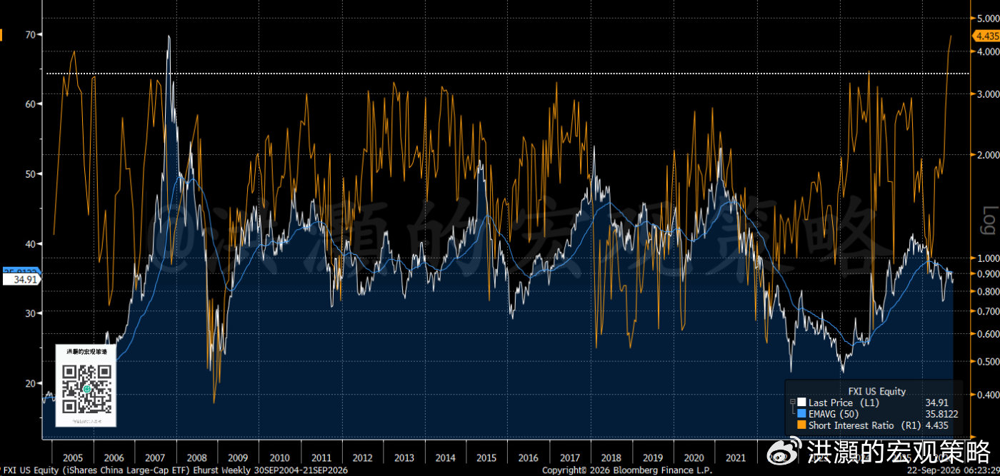
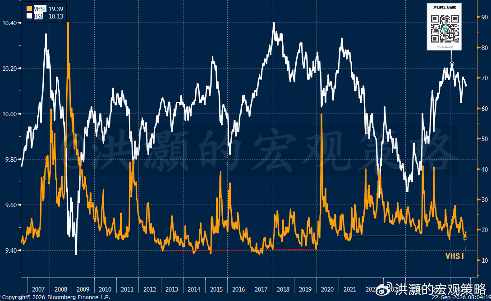
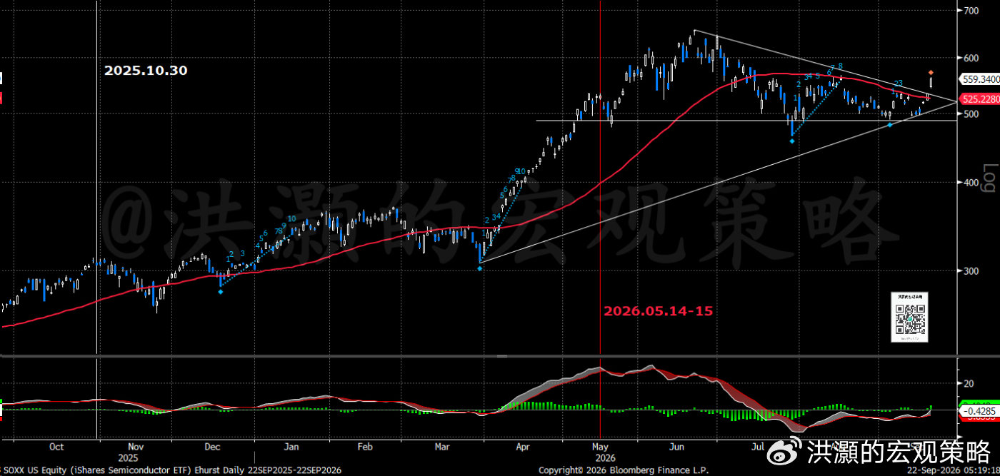

# 洪灝：如何交易 G2 峰会

> 作者：洪灝  
> 来源：微博「洪灝的宏观策略」  
> 发布日期：2026-09-22 09:05  
> 原帖：https://weibo.com/ttarticle/p/show?id=2309405345873847779505  
> 导语：我们继续一项确定性很高的交易

今天，全球资金的目光再度聚焦中美本周四华盛顿会晤。今天纽约的电视充斥着这次盛会的消息，以及元首会晤前的谈判准备。为期一年的贸易摩擦缓和协议大约还有六周就到期了，因此，本次会议对于市场定价的重要性可想而知。

此次会晤的议题将横跨关税、科技、人工智能与伊朗局势。本周会晤是十一月关税自动恢复之前，双方最后一次能坐下来面谈的窗口。会晤前夕，美国贸易代表办公室有意重启了针对中国“产能过剩”的 301 调查，为下一步加税埋下伏笔；然而，稀土出口管制依然有效，并且没有明确的到期时间。稀土依然是我方反制的王牌。比如，八月对美国的稀土出口同比就下降了 21%。市场担忧会晤中这张王牌再次被升级使用的可能性。今天一天，美国的稀缺战略性金属 ETF 就暴涨了逾 40%。

中美峰会对于市场定价的影响是显而易见的。2017 年 4 月，中美在海湖庄园首度会晤，约定百日贸易谈判计划。那次会晤，美国在晚宴时通报了美军空袭叙利亚的消息，颇有几分“项庄舞剑”的意味。然而，2018 年 7 月起美国悍然对 340 亿美元中国商品加征 25% 关税，中方随即对等反制，贸易战自此拉开序幕。同年 12 月的 G20 布宜诺斯艾利斯峰会，中美双方虽然达成 90 天关税休战，但 2019 年 6 月大阪会晤重启谈判后不到两月，特朗普便出尔反尔，将 2000 亿美元中国商品的关税骤然提至 25%，导致半导体设备股当周重挫 7%，是会晤历史上最剧烈的单周冲击。此后，中美双方进入了近半年拉锯，并在 2019 年 12 月敲定了“第一阶段”协议文本，半导体设备股当周大涨 5.6%；最终，2020 年 1 月 15 日正式签署“停火协议”，中方承诺两年增购逾 2000 亿美元美国商品，但多数美国关税并未取消，而疫情接踵而至，贸易战告一段落。

拜登执政期间，中美博弈的性质悄然生变：博弈叙事从“贸易逆差”转向“战略竞争”与供应链安全。2022 年 10 月，美国祭出针对先进半导体的全面出口管制，是整个拜登任期内结构性影响最深远的一步，但因当时全球股市抛售潮也逐步进入了尾声，半导体设备股当周反倒是波澜不惊。也就是在这一发千钧的时刻，我在 2022 年 10 月底发表那篇经典的报告《买！买！买！》。当时，我的这篇报告精准地指出了疫情中市场的历史性大底，并在中外市场广泛传颂。同月的 G20 巴厘岛峰会是中美元首疫情后首次面对面的会晤，双方同意保持沟通，但未见实质让步。2023 年 11 月的三藩市 APEC，两军电话热线开始恢复，关于芬太尼控制的合作达成共识。这是对于美国毒品泛滥甚至失控的局面的善意之举。

特朗普二度执政后，一上任就对华加征了 10% 关税；而 2025 年 4 月的“解放日”关税更将对华税率一度推高至 125% 至 145% 的骇人高位。然而中方毫不犹豫、针锋相对地提出强硬的反制措施，终于在数周僵持后达成了 90 天暂停协议。5 月 12 日日内瓦会谈贸易战正式休战，互惩性关税从 125% 降至 10%，美方对华加权平均新增关税从约 96% 降至约 30%，这是近年国际舞台上最戏剧性的一次降温。当时，美股市场的史诗级暴跌以及特朗普喜欢以股市的涨跌来评价自己的政绩的习惯迫使特朗普不得不服软。“TACO 交易”赫然横空出世。

2025 年 7 月，特朗普罕见地主动放软身段，淡化对抗性言辞，促成了 10 月釜山 APEC 峰会。其后，芬太尼关税从 20% 降至 10%，中方也暂停了稀土出口管制一年，并恢复大豆采购（当时中国马上买 1200 万吨，并承诺此后三年每年 2500 万吨），双方互免港口费与航运附加费一年，休战期延长一年至 2026 年 11 月 10 日。今年 2 月的通话，中方进一步把本季大豆采购目标提到 2000 万吨。然而，原定 4 月的峰会因伊朗战事两度延期，最终于 5 月 14 日至 15 日在北京接待了远道而来的特朗普。这次会晤，市场的反应非常正面，尤其是位于大国博弈最重要板块之一的半导体硬科技。

由此可见，积极的中美会晤对于市场的短期影响是正面的，尤其是对于经济基本面敏感的成长型板块。自从 2025 年特朗普的“解放日”以来，中美的交锋往往是以中方成功反制使得谈判成功的结果，虽然其中不乏曲折的剧情反转。其实，特朗普的品性就像是一个欺软怕硬的“校园恶霸”。中期选举之前，特朗普的民意支持已经降到了冰点，很可能是有史以来历任总统获得的最低的支持率。

此次会晤最核心的议题，无疑是 11 月 10 日到期的休战能否续期。当然，从会晤前我方的起手式，包括继续引导人民币有序升值和大量买入美国农业产品等，我们认为这次休战续期应该是大概率的事件。据美国媒体报道，双方正就一揽子约 300 亿美元的关税削减方案磋商，涉及美国能源、农业产品及中国制造业中间品，部分品类拟适用最惠国待遇，其中对美液化天然气关税的削减也是谈判焦点之一。

也正是在会谈的紧要关头，美方拟依据 301“产能过剩”调查，对中国商品加征 7.5% 附加关税，将现行 12.5% 的税率推高至 20% 的“天花板”。耐人寻味的是，这份调查报告据报道其实在会前已经拟就，却被特朗普政府有意延后发布，以保留谈判筹码。其实，美国越是如此积极地布局，恰恰反映了美国非常希望谈判并取得某种共识的意图。因此，美国在谈判前在努力地增加自己谈判的筹码。

但不要忘了，稀土仍是中方最有力的杀手锏，而 8 月以来，部分稀土供应商已暂停向部分美国企业出货。人工智能治理与技术出口管制，则很可能是很难马上谈拢的议题，因此也最具不确定性。尽管如此，双方很可能无法不各自继续大规模的 AI 资本支出军备竞赛，因此此次谈拢与否都不应该影响实体经济对于半导体和科技硬件的终端需求。人民币中间价已连续八个交易日走强。综合看来，这场峰会大概率不是一次“毕其功于一役”的交易，而更像一次管理式的稳定操作。因此，这次重要会议很可能只是影响短期市场叙事的重要因素之一，而并非全部。

比如，在 2017 年以来的九次中美重要会晤中，六次人民币在会前走强，但近两次釜山与北京峰会前人民币汇率波动却已趋平淡，说明经济基本面对于人民币的走势越发重要，而不是会议的本身。2024 年末以来，我们一直是当时市场上为数不多的、坚定看多人民币升值的经济学家。到如今，市场共识开始凝聚到我两年多前的预测这边来，实是令人欣慰。而人民币已经从那时的 7.5 左右到前几天升破了 6.7。

会议前，大型中国股票指数基金的空头持仓占流通股比例超过了 40%，这是极度拥挤的空头头寸。事实上，这是我们过去二十年有数据以来最高的一次空头持仓比例（图）。一旦峰会释放实质利好，那么将很可能引发一轮因基本面改善而开启的史诗级空头回补行情。这很可能是当前最逆向的交易。

**图：大型中国 ETF 的空头比例有数据历史以来最高；应该有一场渐行渐近的史诗级空头回补行情**

然而，期权市场则颇为“淡定”，恒指科技指数相对大盘的隐含波动率已降至近一年低位，说明期权市场并未押注峰会会带来剧烈波动（图）。

**图：恒指隐含波动率降至一年最低，预示着剧烈的个股行情。**

当然，我们早在年初的时候就预测过，今年整体市场的隐含波动率和个股的隐含波动率将分道扬镳，这是由市场的主导对冲策略决定的。个股之间的相关性非常低，导致个股分化型行情和整体指数波动率下降。被动型指数投资和美国退休基金由于监管要求的改变而变得更趋势性被动投资的策略，直接导致了这种现象。因此，即便是市场整体的隐含波动率不高，并不等于市场的风险就要马上飙升，反而更预示着剧烈的个股行情。一个重要的半导体芯片公司，今天就赫然暴涨了 10%，成为了一家市值超过一万亿美元的公司。

整体而言，谈判对于工业、消费与新能源板块有重要的影响。尽管半导体将是本次会晤的重点议题之一，但是半导体的大国博弈已经进入了全新的层次，因此历史上半导体板块在会议前后的表现并不一定有太多的参考意义。如今，由于囚徒困境的博弈和先发制人的竞争必要性，中美没有谁可以放缓 AI 投入的步伐。

不仅仅如此，如果这次 AI 半导体竞争不能谈拢的话，那么对于半导体设备的需求将急剧上升而不是下降，因为这时会有两个超级大国同时对于先进的 AI 半导体设备产生不计成本的需求；但如果谈拢了，那么对于很多美国的 AI 半导体硬件公司则不失为一个利好。毕竟，中国是他们垂涎已久的市场，不少美国半导体公司对华都有显著的业务布局。从会晤前的市场表现来看，今天半导体指数飙升了逾 4%。除了非死不可的新一代 AI 代理引爆芯片板块之外，市场对于会议议题的预期，肯定也是主要的推手。

纵观全局，这场峰会很可能是一场斗而不破的交锋。中美双方都会各自留有余地，休战协议大概率会以某种折中形式延续，但围绕人工智能与关键技术的结构性角力，恐怕不会因一次握手而烟消云散，但是对于半导体的终端需求无论会议结果如何都将大增。对市场而言，半导体开始突破（图），恒指和大型中概股因空头拥挤、估值折价与资金支撑，具有正面的博弈价值；沪深则受内部流动性与政策托底，下行压力面前会有支持。人民币则将继续其长期升值的趋势。我们在上周市场共识对于美联储加息和 AI 放缓了而悲观的时候，就逆共识地提示读者“不应该过度悲观”。

**图：半导体突破**

中美关系这盘棋，看似风起云涌，实则暗合合久必分、分久必合之理。真正决定胜负手的，在于双方是否能找到一个短期博弈的均衡点。

洪灝  
2026.09.22
