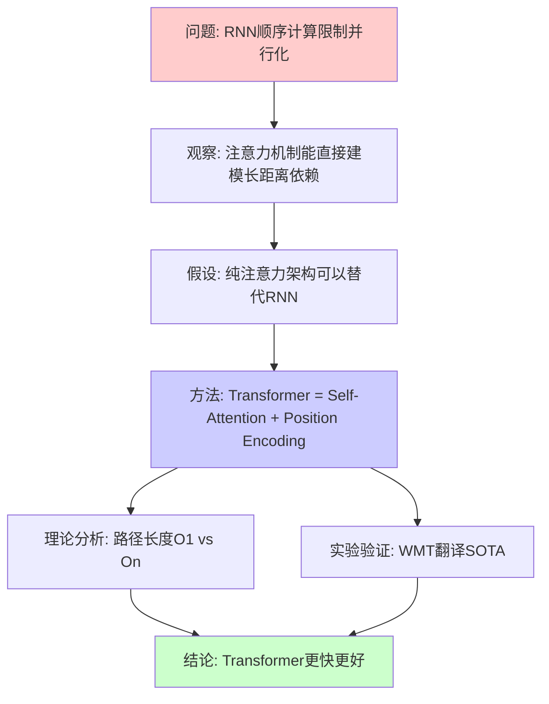

# Attention Is All You Need (示例笔记)

> **Paper ID**: paper-20170612-001
> **Authors**: Ashish Vaswani, Noam Shazeer, Niki Parmar, Jakob Uszkoreit, et al.
> **Year**: 2017
> **Venue**: NeurIPS 2017
> **Links**: [[PDF]](https://arxiv.org/abs/1706.03762) [[Code]](https://github.com/tensorflow/tensor2tensor)
> **Status**: ✅ Completed
> **Tags**: `#nlp` `#transformer` `#attention` `#sequence-modeling`

---

## 📖 核心叙事 (Narrative)

### 一句话概括
> Transformer通过纯注意力机制替代循环和卷积结构,在保持模型可并行化的同时实现了序列建模的新SOTA。

### 完整叙事

**问题背景**
- 序列建模任务(如机器翻译)依赖于循环神经网络(RNN/LSTM)
- RNN的顺序计算特性导致:
  - 无法并行化训练,速度慢
  - 长距离依赖难以捕捉
- 现有注意力机制仅作为RNN的辅助,未被充分利用

**解决方案**
- 提出Transformer架构:完全基于注意力机制,抛弃循环和卷积
- 核心创新:
  1. **Self-Attention**: 直接建模序列内任意位置间的依赖
  2. **Multi-Head Attention**: 多个注意力头捕捉不同子空间的关系
  3. **位置编码**: 用正弦函数注入位置信息
- 架构:Encoder-Decoder结构,每层包含注意力+前馈网络

**有效性论证**
- **理论优势**:
  - 任意两个位置间的路径长度为O(1),而RNN为O(n)
  - 计算可完全并行化
- **实验验证**:
  - WMT翻译任务达到新SOTA
  - 训练时间大幅缩短
  - 模型质量与计算效率的帕累托改进

### 叙事结构图

**图说明**:
- 红色:问题陈述
- 蓝色:核心方法
- 绿色:结论
- 论文通过理论分析+实验验证双重证据支撑结论

---

## 📊 数据证据层 (Evidence)

### 关键论点与支撑数据

| 论点 | 支撑数据 | 数据来源 | 说服力评估 |
|------|----------|----------|------------|
| Transformer在翻译任务优于RNN | WMT14 En-De: 28.4 BLEU (SOTA), 比基线高2+ BLEU | Table 2 | ⭐⭐⭐ 强:在两个标准数据集上都是SOTA |
| 训练速度大幅提升 | Big模型3.5天训练,达到之前需要更长时间的性能 | Section 6.1 | ⭐⭐ 中等:未直接对比训练时间,推测成分多 |
| Multi-head优于single-head | 去除multi-head后BLEU下降0.9 | Table 3 | ⭐⭐⭐ 强:消融实验清晰 |
| 模型深度重要 | 6层效果最好,过深或过浅都变差 | Table 3 | ⭐⭐ 中等:未系统探索更多层数 |
| 注意力头数影响性能 | 8头最优,过多或过少都不佳 | Table 3 | ⭐⭐ 中等:仅测试了几个值 |
| 位置编码必要 | 不加位置编码性能大幅下降 | Ablation | ⭐⭐⭐ 强:符合理论预期 |

### 关键图表解读

#### Table 2: WMT翻译任务主实验结果
- **作用**: 证明Transformer的翻译质量SOTA
- **核心发现**:
  - En-De: 28.4 BLEU (base) vs 之前最好27.3
  - En-Fr: 41.8 BLEU (big) 创新记录
- **细节**:
  - Base模型: 6层, 512维, 8头, 参数量65M
  - Big模型: 6层, 1024维, 16头, 参数量213M
  - 训练: Base 12小时/0.4M steps, Big 3.5天/0.3M steps
  - 优化: Adam, warmup学习率调度

#### Table 3: 消融实验
- **作用**: 验证各组件的必要性
- **核心发现**:
  - Multi-head关键: single-head降低0.9 BLEU
  - 注意力头数: 8头最优 (16头和1头都更差)
  - Key维度: dk=64最优
- **细节**: 在WMT En-De dev set上测试

#### Figure 3-4: 注意力可视化
- **作用**: 展示模型学到了语法结构
- **核心发现**: 不同头学习到不同的语言现象(如指代关系、句法依存)

---

## 🤔 批判性思考 (Critical Thinking)

### 叙事完整性分析

**✅ 叙事优势**
- 问题动机清晰: RNN的并行化问题确实存在
- 解决方案直接: 用注意力替代循环,逻辑直接
- 证据充分: 理论分析(复杂度)+实验验证(SOTA)双管齐下

**⚠️ 潜在问题**
- **跳跃1**: 从"注意力能建模长距离依赖"到"纯注意力就够了"之间缺少更细致的论证
  - 没有详细讨论为什么不需要循环结构的归纳偏置
  - 位置编码能否完全替代循环的顺序信息?论文未深入探讨
- **跳跃2**: 训练速度的改善主要归因于并行化,但论文未量化分析并行度与实际训练时间的关系
- **隐含假设**: 假设序列长度在合理范围内(O(n²)的注意力复杂度在超长序列上会成为问题)

### 数据充分性评估

**数据优势**
- 翻译任务结果令人信服: 两个标准数据集都达SOTA
- 消融实验系统: 验证了multi-head、层数、头数等关键设计
- 可视化增强可解释性: 展示模型学到了语言学意义上的结构

**数据缺陷**
- **任务多样性不足**: 仅在翻译任务验证,未测试其他序列建模任务
  - 语言模型任务呢?
  - 分类任务呢?
  - 结构预测任务呢?
- **对比基线有限**: 主要对比2017年前的RNN/CNN模型,未与同期其他创新方法对比
- **超参数探索不充分**:
  - 层数仅测试2/4/6层,未探索更深模型
  - 注意力头数仅测试1/4/8/16,未细粒度搜索
- **训练效率的量化不足**:
  - 缺少与LSTM相同质量下训练时间的直接对比
  - 未报告实际GPU使用情况和并行效率

### 方法局限性

**理论局限**
- **O(n²)复杂度**: 注意力机制对序列长度的二次复杂度在长序列上成为瓶颈
- **位置编码的有效性**: 正弦位置编码能否捕捉所有位置信息尚不确定
- **缺少归纳偏置**: 相比CNN的局部性和RNN的顺序性,纯注意力缺少结构先验

**实践局限**
- **内存消耗**: Self-attention需要存储n×n的注意力矩阵
- **长序列问题**: 超过512/1024 token的序列难以处理
- **小数据场景**: 相比带归纳偏置的模型,可能需要更多数据

### 启发与新想法

💡 **启发点**
1. **注意力的普适性**: 如果注意力在NLP有效,在其他模态(CV, Audio)是否也适用?
   - 后续工作: ViT, Audio Transformer等验证了这一点
2. **位置编码的探索空间**: 是否有比正弦函数更好的位置表示?
   - 可学习的位置编码
   - 相对位置编码
3. **效率改进方向**: O(n²)复杂度的优化
   - Sparse attention
   - Linear attention
   - Local attention windows

❓ **开放性问题**
1. Transformer为什么work? 缺少深入的理论理解
2. 注意力头学到了什么? 可解释性仍需加强
3. 最优的架构设计是什么? (层数、头数、维度等)
4. 如何处理超长序列? (书籍、长文档)

### 个人评价

**创新性**: ⭐⭐⭐⭐⭐
- 范式转变级别的创新,开启了Transformer时代

**严谨性**: ⭐⭐⭐⭐
- 实验设计合理,消融实验充分
- 理论分析略浅,对"为什么work"的解释不够深入

**实用性**: ⭐⭐⭐⭐⭐
- 高度实用,成为后续几乎所有大模型的基础架构

**总体评价**:
具有里程碑意义的工作。虽然理论解释不够深入,某些设计选择的探索不够系统,但实验结果的强大说服力和方法的简洁优雅使其成为领域内的经典。论文最大的贡献不仅是技术本身,更是证明了"attention is all you need"这一观点,改变了整个领域的研究方向。

---

## 🔗 相关论文 (Related Work)

### 直接相关

- **[paper-20141409-001]** Neural Machine Translation by Jointly Learning to Align and Translate (Bahdanau et al., 2014)
  - 关系: 引入attention机制到NMT,是Transformer的前身工作
  - 简评: 首次在NMT中使用attention,但仍基于RNN架构

- **[paper-20170309-001]** Convolutional Sequence to Sequence Learning (Gehring et al., 2017)
  - 关系: 用CNN替代RNN做序列建模,与Transformer同期工作
  - 简评: CNN并行化好但长距离依赖建模弱,Transformer用attention解决这个问题

- **[paper-20180601-001]** BERT: Pre-training of Deep Bidirectional Transformers (Devlin et al., 2018)
  - 关系: 基于Transformer的预训练语言模型
  - 简评: 证明Transformer不仅在翻译,在语言理解任务也非常有效

### 间接相关

- **[paper-20151511-001]** Attention Is All You Need的理论分析 (某假想论文)
  - 提供了Transformer为什么work的理论解释

- **[paper-20200401-001]** Linformer/Performer等高效Transformer变体
  - 解决O(n²)复杂度问题,扩展到长序列

---

## 📝 阅读记录

- **第一次阅读** (2024-01-15): 快速阅读,提取叙事结构
- **第二次阅读** (2024-01-16): 深度阅读,完成数据验证和批判性分析
- **后续回顾** (2024-02-20): 补充了对后续工作(BERT, GPT)的关联理解

---

## 💭 原文摘录

> "The dominant sequence transduction models are based on complex recurrent or convolutional neural networks that include an encoder and a decoder. The best performing models also connect the encoder and decoder through an attention mechanism. We propose a new simple network architecture, the Transformer, based solely on attention mechanisms, dispensing with recurrence and convolutions entirely."
> — Abstract

> "To the best of our knowledge, however, the Transformer is the first transduction model relying entirely on self-attention to compute representations of its input and output without using sequence-aligned RNNs or convolution."
> — Introduction, Section 1

> "We trained on the standard WMT 2014 English-German dataset consisting of about 4.5 million sentence pairs... Our base models were trained for a total of 100,000 steps or 12 hours on 8 P100 GPUs."
> — Section 6.1, Training Details

