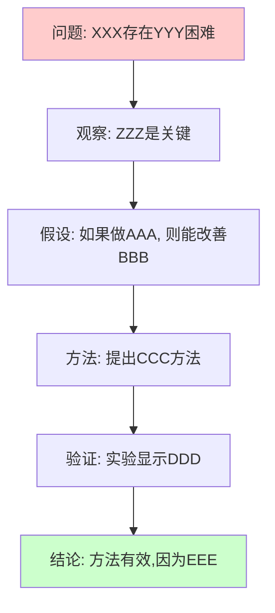

# Attention Is All You Need

> **Paper ID**: paper-20260227-001
> **Authors**: Vaswani et al.
> **Year**: 2017
> **Venue**: NeurIPS
> **Links**: [[PDF]](https://arxiv.org/abs/1706.03762) [[Project]](https://arxiv.org/abs/1706.03762) [[Code]](https://arxiv.org/abs/1706.03762)
> **Status**: ⚪ Unread
> **Tags**: `#nlp` `#transformer` `#attention`

---

## 📖 核心叙事 (Narrative)

### 一句话概括
> 用一句话概括论文的核心主张

### 完整叙事

**问题背景**
- 研究什么问题?
- 为什么这个问题重要?
- 现有方法有什么不足?

**解决方案**
- 论文提出了什么方法/观点?
- 核心创新点是什么?
- 与现有方法的关键区别在哪里?

**有效性论证**
- 为什么这个方案能工作?
- 理论依据是什么?
- 实验如何验证有效性?

### 叙事结构图

**图说明**:
- 红色节点:问题陈述
- 绿色节点:结论
- 中间节点:论证链条

---

## 📊 数据证据层 (Evidence)

### 关键论点与支撑数据

| 论点 | 支撑数据 | 数据来源 | 说服力评估 |
|------|----------|----------|------------|
| 论点1:方法X在任务Y上优于基线 | X方法达到95%准确率,基线仅85% | 表1, 图3 | ⭐⭐⭐ 强:样本量充足,差异显著 |
| 论点2:组件A是关键 | 消融实验显示去除A后性能下降15% | 表2 | ⭐⭐ 中等:仅一个数据集验证 |
| 论点3:方法可扩展到大规模数据 | 在10M样本上训练仍保持性能 | 图5 | ⭐ 弱:缺少与其他方法的对比 |
| ... | ... | ... | ... |

### 关键图表解读

#### 图/表X: [标题]
- **作用**: 这个图表在叙事中的作用
- **核心发现**: 最重要的观察结果
- **细节**:
  - 数据集: XXX
  - 实验设置: YYY
  - 对比基线: ZZZ

#### 图/表Y: [标题]
[类似格式]

---

## 🤔 批判性思考 (Critical Thinking)

### 叙事完整性分析

**✅ 叙事优势**
- 逻辑链条清晰的部分
- 论证充分的论点

**⚠️ 潜在问题**
- 逻辑跳跃:从X到Y的推理不够充分,因为...
- 未讨论的替代解释:YYY也可能导致观察到的现象
- 隐含假设:论文假设了AAA,但这可能不成立,因为...

### 数据充分性评估

**数据优势**
- 实验设计严谨的地方
- 数据充分支持的论点

**数据缺陷**
- 缺失的实验:应该验证XXX但没有做
- 数据集局限:仅在YYY数据上测试,缺少ZZZ场景
- 统计问题:样本量不足 / 缺少显著性检验 / ...

### 方法局限性

**理论局限**
- 方法的适用边界
- 理论假设的局限

**实践局限**
- 计算成本
- 实现复杂度
- 可重现性问题

### 启发与新想法

💡 **启发点**
- 这个方法让我想到可以应用于...
- 如果结合XXX方法,可能可以...

❓ **开放性问题**
- 论文没有解决的问题
- 值得进一步探索的方向

### 个人评价

**创新性**: ⭐⭐⭐⭐⭐ (1-5星)
**严谨性**: ⭐⭐⭐⭐⭐
**实用性**: ⭐⭐⭐⭐⭐
**总体评价**: [简短评价]

---

## 🔗 相关论文 (Related Work)

### 直接相关

- **[paper-id-1]** 论文标题
  - 关系:本文的基础工作 / 对比方法 / 后续改进
  - 简评:...

- **[paper-id-2]** 论文标题
  - 关系:...
  - 简评:...

### 间接相关

- **[paper-id-3]** 论文标题: 提供了相关的理论基础
- **[paper-id-4]** 论文标题: 类似问题的不同解决方案

---

## 📝 阅读记录

- **第一次阅读** (2017-MM-DD): 提取叙事,完成第一阶段
- **第二次阅读** (2017-MM-DD): 深度阅读,完成数据验证和批判性思考
- **后续回顾** (2017-MM-DD): 补充了XXX部分的理解

---

## 💭 原文摘录 (可选)

记录论文中特别重要或精彩的原文段落:

> "原文引用1"
> — 出处: Section X, Page Y

> "原文引用2"
> — 出处: ...

