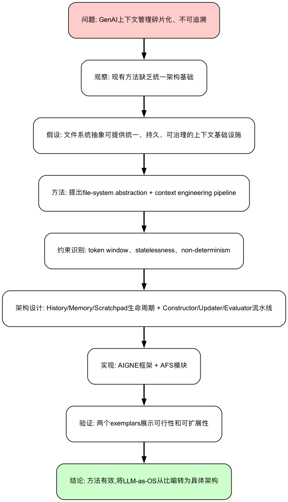

# Everything is Context: Agentic File System Abstraction for Context Engineering

---

## 📖 核心叙事 (Narrative)

### 一句话概括
> 论文提出将文件系统抽象作为GenAI系统上下文工程的统一基础设施,通过"万物皆文件"的Unix哲学实现可追溯、可验证的上下文管理。

### 完整叙事

**问题背景**
- 研究什么问题?当前GenAI和Agentic系统中的上下文工程(context engineering)缺乏统一的架构基础,导致上下文管理碎片化、不可追溯且难以验证
- 为什么这个问题重要?随着GenAI从被动工具转变为主动协作者,如何系统地捕获、结构化和治理外部知识、记忆、工具和人类输入成为核心架构挑战。上下文不当管理会导致context rot(上下文腐化)、knowledge drift(知识漂移)和不可信的推理结果
- 现有方法有什么不足?
  - LangChain、AutoGen等框架的上下文管理是临时性的(ad hoc)、瞬态的(transient)和不透明的(opaque)
  - RAG、prompt engineering、tool integration等实践是割裂的,缺乏统一接口
  - 缺少对上下文生命周期的系统性治理机制
  - 上下文产物(artefacts)缺乏可追溯性和可审计性

**解决方案**

| 提出的方法 | 解决什么问题/约束 | 创新点 |
|-----------|------------------|--------|
| 文件系统抽象 (论点2) | 现有上下文管理碎片化、缺乏统一接口 | 基于Unix"万物皆文件"哲学,将所有上下文源(知识、记忆、工具、人类输入)统一为文件系统接口(list/read/write/search) |
| History/Memory/Scratchpad三层生命周期 | 缺乏持久化、可追溯的上下文管理机制 | 明确区分不可变真实源(History)、结构化索引视图(Memory)、临时工作空间(Scratchpad),实现完整上下文生命周期 |
| 上下文工程流水线 (论点3) | Token window硬约束(128K-200K)、模型无状态性、输出不确定性 | Constructor/Updater/Evaluator三组件协同工作,从架构层应对模型约束,形成闭环验证 |
| Human-in-the-loop架构 (论点5) | 隐性知识难以融入系统推理 | 将人类作为一等公民嵌入上下文评估和验证环节,人类标注成为系统核心输入 |
| AIGNE框架实现 (论点4) | 缺乏可落地的完整实现 | 开源框架完整实现提出的架构,支持MCP协议,提供exemplars验证可行性 |

### 叙事结构图

---

## 📊 数据证据层 (Evidence)

### 关键论点与支撑数据

| 论点 | 支撑数据 | 数据来源 | 说服力评估 |
|------|----------|----------|------------|
| 论点1:现有上下文管理方法是碎片化和ad hoc的 | 引用LangChain、AutoGen等工业框架,指出它们"lack unified mechanisms for traceability, governance, and lifecycle management" | Section II相关工作综述 | ⭐⭐⭐ 强:基于工业实践的系统性综述,有权威引用 |
| 论点2:文件系统抽象符合SE第一性原理 | 详细论述5个SE原则(abstraction, modularity, encapsulation, separation of concerns, composability)如何体现在设计中 | Section III | ⭐⭐⭐ 强:理论论证充分,每个原则有具体的架构对应 |
| 论点3:token window是传播到架构层的硬约束 | 引用GPT-5(128K)、Claude Sonnet 4.5(200K)的具体token限制,说明"quadratic complexity of self-attention mechanism" | Section V-A1 | ⭐⭐⭐ 强:有具体数据和理论依据 |
| 论点4:AIGNE框架实现了提出的架构 | 提供GitHub开源链接和两个code listings展示实际实现 | Section VI | ⭐⭐ 中等:有代码实现但缺少性能评测、用户研究 |
| 论点5:方法支持人类作为上下文工程的核心参与者 | 描述Context Evaluator中的"human-in-the-loop"机制,human annotations作为"first-class component" | Section V-B3 | ⭐ 弱:理论描述充分但缺少实际案例和效果验证 |

---

## 🤔 批判性思考 (Critical Thinking)

### 核心问题

1. 这个方法的核心假设是什么?在什么情况下会失效?
   - 核心假设:文件系统抽象足以表达所有类型的上下文关系;统一接口(list/read/write/search)足够通用
   - 可能失效:高度动态的上下文关系(如实时变化的知识图谱);需要复杂查询和推理的场景(如多跳关系查询);超大规模上下文(百万级文件)的性能和可扩展性未经验证

2. 方法有哪些关键局限?
   - 文件系统的树形结构难以表达复杂的时序依赖、多对多关系、动态演化的知识图谱
   - 从实际上下文源到文件系统抽象的映射可能丢失语义信息
   - list/read/write/search可能不足以表达复杂查询需求

3. 实验设计是否充分?缺少哪些关键验证?
   - 没有对比AFS与现有方案(LangChain、AutoGen)的定量差异;未测试大规模上下文性能;缺少用户研究
   - 没有在标准RAG benchmarks上验证效果;仅在两个简单场景验证,缺少复杂真实场景测试
   - 缺少与向量数据库、知识图谱等专用方案的trade-off分析
